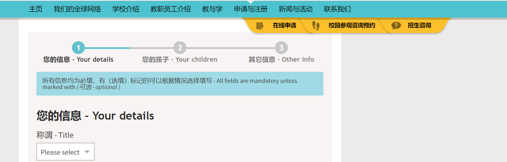
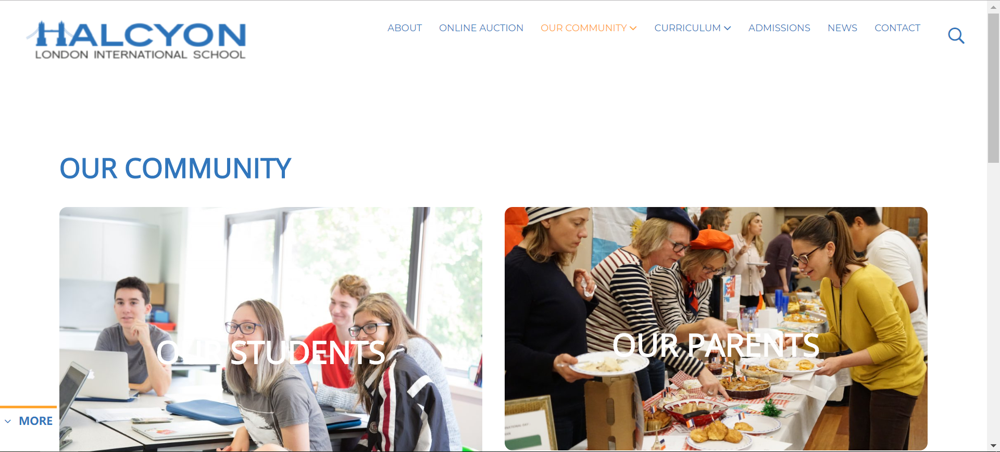
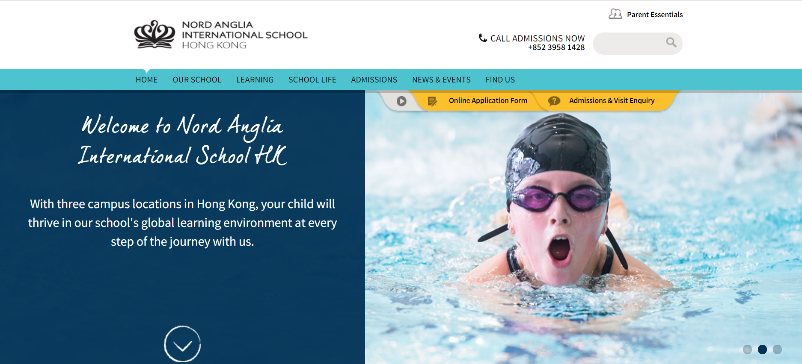

# 概述

`瑞安惟理达书院门户(portal)`  的第一阶段[板块](https://shimo.im/sheet/4wibPJ7ac8QZCXW0/ChXSi)：

- 招生`ruianva.cn/2.admissions/`
- 教辅 `ruianva.cn/5.assistant/`
  - 图书馆 `ruianva.cn/5.assistant/library/`
  - 报告单在线导出 `ruianva.cn/5.assistant/report/`

# ref

[halcyon伦敦国际学校](https://halcyonschool.com/our-community/)

[美中国际GIA学校](http://griffinintl.org/)

[nord anglia 诺德安达国际学校—香港分校](https://www.nordangliaeducation.com/our-schools/hong-kong/)

[波士顿三一学校](https://www.bostontrinity.org/academics/overview)

- ui
  - [校园风格ui](http://demo.cssmoban.com/cssthemes4/cpts_936_bqd/index.html)
  - [CHURCH](http://demo.cssmoban.com/cssthemes4/ft5_79_church/index.html)

# [内容板块](https://shimo.im/sheet/4wibPJ7ac8QZCXW0/ChXSi)

波士顿三一：学院、使命、学术（会议）、信仰、艺术、体育、学生生活、毕业生、奉献窗口

中美板块：(我们的)学校 课程 校园 新闻 新闻 活动 团队 入读GIA 加入GIA

评论：

- 导航尽可能不设置二级标题；
  - va介绍以叙述为主而非材料学术叙述；

- 我认为应该继承本校的特色专栏，大类别上  惟理talk(学生，家长，老师们的图书分享以及演讲)；
- 家长合唱团 parents choir，提供合唱团 近期排练以及演出实况

 

## reference

### @vivis

我觉得在大类上定板块，在子类别种显惟校特色，这样也比较容易让家长找到相应信息。学校大类确实是学生，家长，老师，还可以有特色专栏

1.学生：学生的作品，展览，演讲俱乐部组建；2.家长：家长合唱团，家长讲座，家长读书会；3.特色专栏：学生活动，趣味运动会，乐队组建，英语演讲比赛等

### @曾曾

浏览Halcyon网页不仅不累而且收获颇丰，从颜色搭配到内容设置都恰到好处，并且特色突出，我想我们可以参照他们的模板加上自己的特色。

我觉得大体上惟校需要解释三个问题：

- 理念是如何实践的
- 国家义务教育与港式教育同步是如何实现的
- 国际化教育所要求的以学生为本是如何展现的。所以大板块大致如下(英文):     

### @欧泽霖

1. 应先处理顶层设计，陈列惟校现在及未来的状况，把资讯分门别类的大框架先订好。
2. 为体现惟校各持份者合作紧密及环环相扣的文化，能否采用六角形的蜂窝介面，而不用坊间的长方或四方介面，概念图见PPT。
3. 网站程式编写宜保持灵活多变，方便日后配合学校发展而作合理修改。

校园合作下

- 运动会
- 海外游学
- 义工服务
- 学术交流
- 音乐汇演
- 艺术展览

1. 应先处理顶层设计，陈列惟校现在及未来的状况，把资讯分门别类的大框架先订好。
2. 为体现惟校各持份者合作紧密及环环相扣的文化，能否采用六角形的蜂窝介面，而不用坊间的长方或四方介面，概念图见PPT。
3. 网站程式编写宜保持灵活多变，方便日后配合学校发展而作合理修改。
