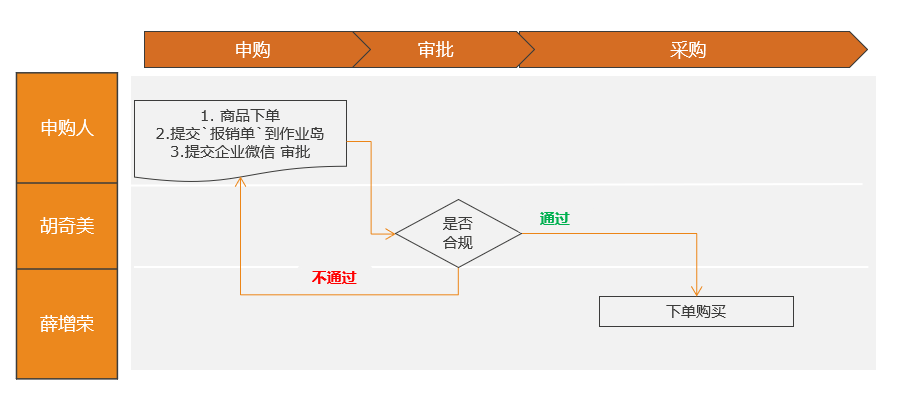
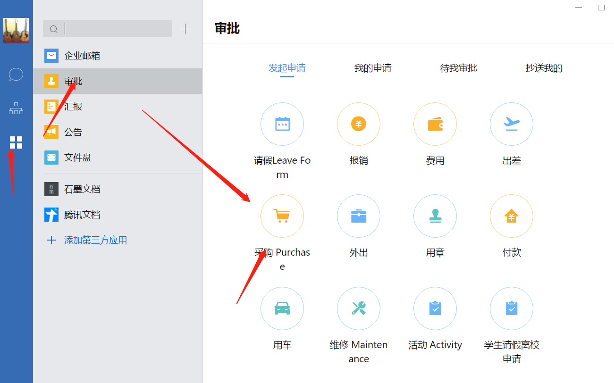
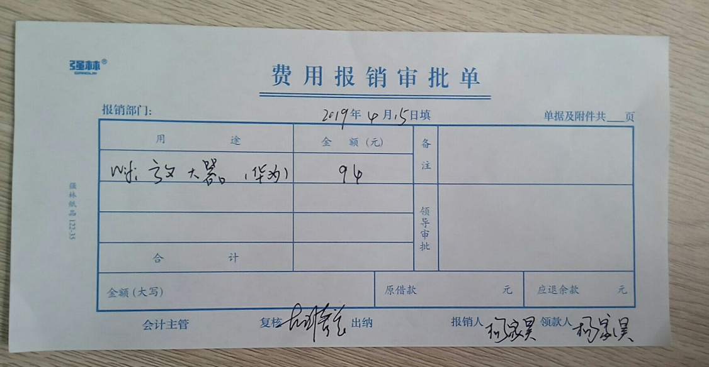

# 常用信息

- 抬头信息：
  - 抬头：`瑞安市惟理达书院`: 
  - 税号：`52330381MJ9303488F`

- 作业岛：

  - `203`打印机区透明邮递箱；

    

# 未买申购

说明：`申购人`先确认`瑞安汇丰店`是否有货，若有优先从`瑞安汇丰店`采购；

- `申购人`登陆淘宝账号`rvabuy`，与taobao`店主`确认是否有`发票`或`电子发票`后下单；

- `申购人`微信企业填写`采购流`（只填写`订单号`和`必要性说明`）；  

    

- `申购人`填写`费用报销审批单`到`作业岛`；

    - `报销人`写`申购`人；
    - `领款人`留空；

- `复核人`确认合规后批准；

- `采购人`根据`采购流批准` + `审批单`信息后进行`采购`。

    

# 已买报销

- `报销人`将`发票` + `费用报销审批单` 用回形针🖇扣好，放到`作业岛`：

  - `审批单`：个人支付购买在`领款人`上填写`本人姓名`；
  - 若没有发票，需提供等值的报销发票来替代；

- `申购人`微信企业填写`报销流`（是否可删除？）；

   

- `复核人`审批后；

- `报销人`根据`报销流批准` + `审批单+发票`进行打款；

## 淘宝自助电子发票填写

