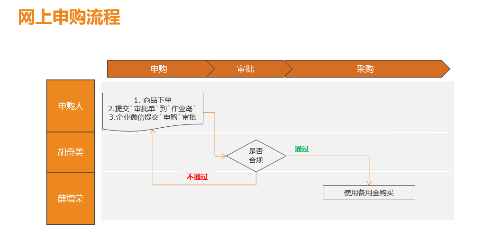
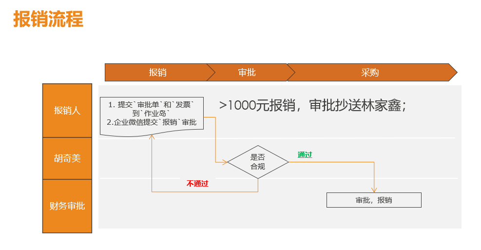

# 常用信息

- 抬头信息：
  - 抬头：`瑞安市惟理达书院`: 
  - 税号：`52330381MJ9303488F`

- 文具仓库：`302`；

- `作业岛`（报销/审批文件处理）：

  - `203`打印机区；

  

    

# 未买申购

说明：`申购人`优先确认所需物品是否已经在`惟校资产清单`内，详查[石墨清单](https://shimo.im/sheet/UFae1MU8GmUXUKeu/gF0sA)；

若不在`资产清单`，且属常见文具用品，优先填写`汇丰文具申购`[清单](https://shimo.im/sheet/UFae1MU8GmUXUKeu/3bjMr)，图书馆`梁玉雁`审核后将定期采购；

- 咨询方式：`0577-58820801`，微信号 `ruianhuifeng`；
- 主营商品：办公耗材、文具、体育用品；

其他物品的网上申购流程：

- `申购人`：

    - 登陆网购账号`rvabuy`，需要与`店主`确认是否有`发票`或`电子发票`后下单；
    - 微信企业填写`申购流`；  

    - 填写`费用报销审批单`到`作业岛`；
        - `报销人`写`申购人姓名`；
        - `领款人`留空；

- `审批人`：

    - 从作业岛查看`审批单`，确认后在`申购流`批准；
    - 默认复核人：`胡奇美`

- `采购人`：

    - 根据`申购流` + `审批单`信息后进行`采购`。

      

# 已买报销

- `报销人`：
  - 将`发票` + 填写好的`费用报销审批单` 用回形针🖇扣好，放到`作业岛`：
    - `领款人`上填写`购买人姓名`；
    - 若没有发票，需提供等值的报销发票来替代；
  - 微信企业填写`报销流`；
- `复核人`：
  - 从作业岛查看`审批单`，确认后在`报销流`批准；
- `报销人`：
  - `报销人`信息：
    - 姓名：恩琪
    - 职位：财务
    - 联系信息：153 8258 0707
    - 周1/2/5在402；
  - 周一、周二、周五；
  - 根据`报销流` + `审批单+发票`进行`复核审批`，`打款`；
  - 报销材料齐全，2周左右直接打款到`工资银行卡`上；

## 淘宝自助电子发票填写

