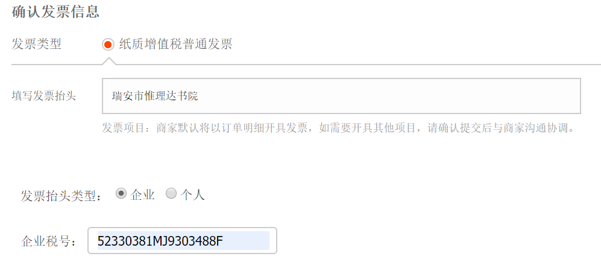

# 常用信息

- 抬头信息：
  - 抬头：`瑞安市惟理达书院`: 
  - 税号：`52330381MJ9303488F`
  - 邮箱：544404@163.com

- 文具仓库：`302`；

- 若不在`资产清单`，且属常见文具用品，优先填写`汇丰文具申购`[清单](https://shimo.im/sheet/UFae1MU8GmUXUKeu/3bjMr)；

  - 咨询方式：`0577-58820801`，微信号 `ruianhuifeng`；
  - 主营商品：办公耗材、文具、体育用品；

- `作业岛`（报销/审批文件处理）：

  - `203`打印机区；

  

    

# `申购`

即通过`备用金`购买，由`采购人`进行报销的流程；

- 何种情况需要走`申购`：
  - `图书馆购书`必须走`申购`流程，不能走`报销`流程；
  - 为节省`采购人报销`流程，原则上只有每个学期开学前一周时间为`申购窗口`；

流申流程：

- `申购人`：填写`申购`审批；
- `审核人`：审核校验；
- `采购人`：完成`购买`后，汇入`惟校资产清单`。
  - `采购人`再通过`费用报销单`审批进行`报销`。

# `费用报销单`

即通过`自费`购买，自行报销的流程，请在购买前提审批；

- `报销人`：打印企业微信`费用报销单`（已批准、且签好`报销人`、`领款人`）+ 发票 ，用回形针🖇扣好，放到`作业岛`；
- `复核人`：企业微信`费用报销单`上审批；
- `报销人`：郑恩其
  - 职位：财务
  - 联系信息：153 8258 0707
  - 周1/2/5中午在402；

## 淘宝自助电子发票填写

