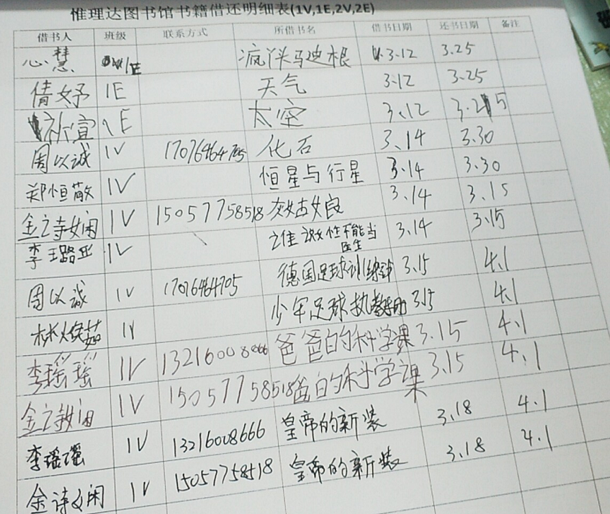
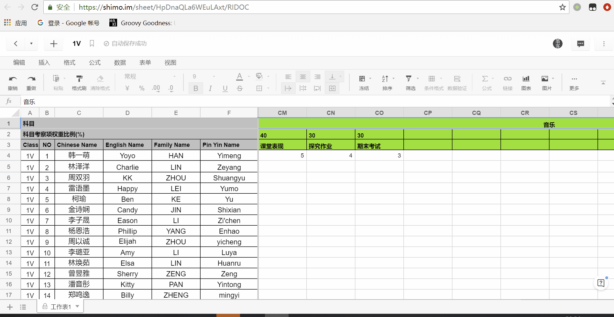
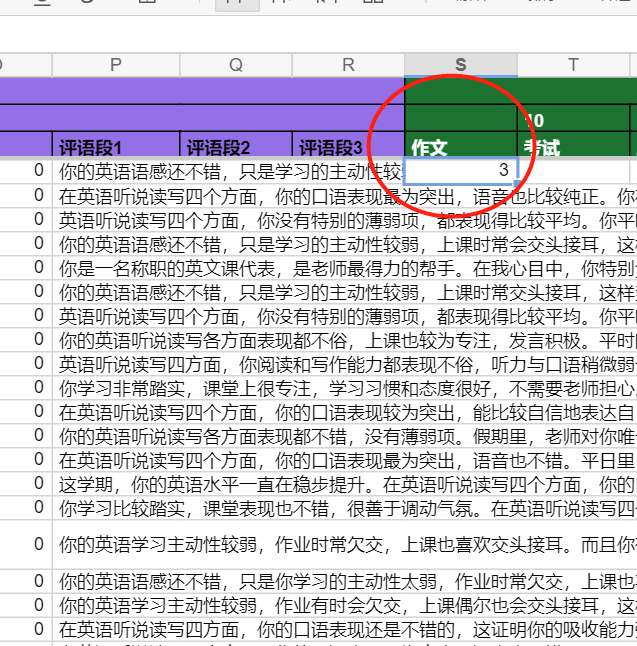
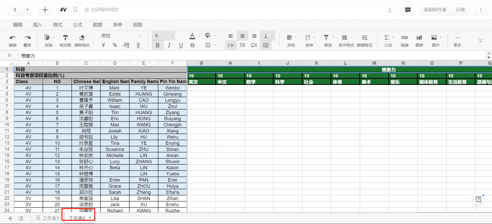
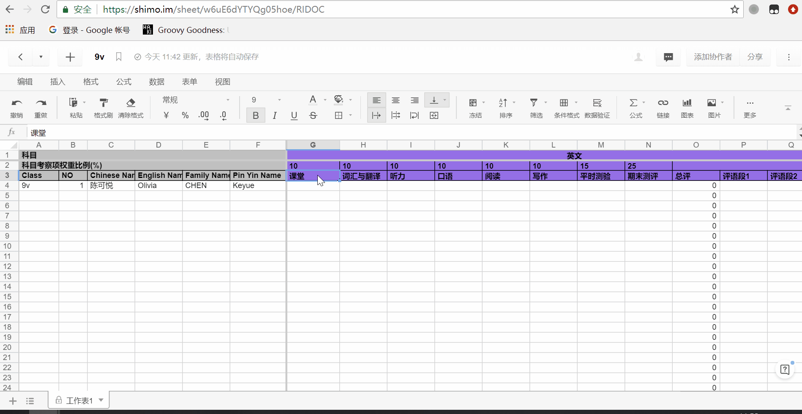
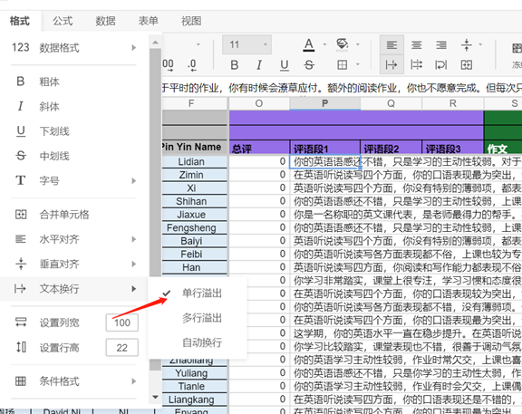

# 人人都懂Markdown

## 为什么使用markdown

- `markdown`是一组标记文档的语言，旨在将用户的精力聚焦在编辑文档的`逻辑`、`层次`内容上，而非浪费在`格式展示`、`美化排版`(这部分的工作被剥离成独立的`格式模板`由大量社区美工提供)，`markdown`几乎是所有主流IT社区撰写博客的默认语言；
- 任何`文字工作者`（尤其是`IT工程师`、`教师`、`作家`、`图书馆编辑`）都将从使用markdown中获得如下好处：

  - 基于纯文本编辑器，快速遍历检索：

  - 配合使用git/svn，可以十分方便的追溯你的编辑历史；
  - 海量精美模板，直接生成排版好的文档；
  - 开源社区开发了大量基于markdown拓展工具
    - 制作wiki手册: gitbook/docsify
    - 格式转换工具，快速导出各类格式：docx/chm/pdf/html
- 虽然markdown的常用语法十分简单，但是依然推荐使用如[typora](https://typora.io/)的编辑器来过渡从word到markdown的使用，他提供了许多实用的 快捷键；
- 如果你是程序员，几乎所有的现代编辑器(sublime/vscode/atom...)都支持markdown编写、预览；


## markdown语法

- [基础语法](https://www.jianshu.com/p/191d1e21f7ed)
- [table宽度](https://hacpai.com/article/1463381341661)

- 分段落写数字标题，因为CSS会自动处理
    - 替换已有各级标题
`(^#+ +)[\d\.]+` -> `$1`


- 引用
    由`>`开始，以两个回车作为引用结束，注意引用内容中的回车无法被识别，如果一定要有回车，使用`<br>`代替。

- 专有名词、单行代码/代码区
  - \`code\` 
  - 代码区
    ```
        ```language
    ```
    ```
    如css代码：
    ​```css
    table th:first-of-type {
    ​    width: 100px;
    }
    th:nth-of-type(2)
    ```

    ```
    或如java代码：
    ​```java
    System.out.println("asd")
    ```


# vscode+markdown

- [下载安装](https://code.visualstudio.com/)
- 启动vscode
- 执行`ctrl+shift+x`：下载插件Markdown All in One + Markdown Preview Enhanced
- 或者通过[离线链接](https://marketplace.visualstudio.com/items?itemName=yzhang.markdown-all-in-one#overview)下载安装：
- 重启vscode
- ctrl+k v或编辑器右上角启动 mpe预览窗口


### 快捷键

```
Ctrl + p 文件搜索
Ctrl + shift + f 代码搜索
Ctrl + `  打开默认终端;
Ctrl + KS 修改快捷键
Ctrl + Shift + `  新建新的终端;
Ctrl + Shift + Y  打开调试控制台,然后再自行切换终端选项;
Shift + ALT + F 格式化代码
ctrl+o: 函数列表，outline
ctrt+shift+o ：点击跳到局部
```

### 主题

文件->首选项->颜色主题
MPE预览窗口主题：
`ctrl+shift+p`->>输入 customize ->编辑[style.less](style.less)

设置快捷键 `Markdown`:触发代码块编辑C:\Users\XXX\.vscode\extensions\yzhang.markdown-all-in-one-1.6.0\out\src\formatting.js
```javascript
function toggleCodeSpan() {
    return styleByWrapping('```');
}
```

---

## 格式转换

- [word插件 Writage](https://www.jianshu.com/p/df6a136d06d8)

一款office插件，安装后可直接通过F12另存为MARKDOWN插件，且表格和图片都能保存完整。

## [pandoc](https://blog.csdn.net/gyzhe/article/details/46306695)

基于命令导出docx/pdf/chm；

### 安装

[下载2.5](https://github.com/jgm/pandoc/releases)，解压后配置PATH，`pandoc -v`确认一下；

### 使用介绍

[支持转换命令范例](https://blog.csdn.net/gyzhe/article/details/46306695)

- docx->md

```shell
pandoc --extract-media ./ HD性能调优.docx -o output.md
```

- [MD->docx](https://github.com/jgm/pandoc/wiki/Pandoc-with-Chinese)

    - 导出模板进行修改

        ```
        pandoc --print-default-data-file reference.docx > reference.docx
        ```
    - 修改模板
        ```shell
        pandoc -f markdown -t docx --reference-doc reference.docx table.txt -o xxx.docx
        
        # 进行替换正则表达式
        \[.*?\]
        []
        #下载panflute panflute-1.10.6-py3-none-any.whl
        pandoc  --filter=filter2.py --reference-doc=tmplate.docx  2.3.HD配置规划.md -o markdown.docx
        ```

### Q&A

- docx->md 图片丢失问题，需要指定 `--extract-media`

- [表格样式丢失问题](https://github.com/jgm/pandoc/issues/3275)

- xelatex[不推荐]

    ```shell
    pandoc -N -s --toc --pdf-engine=xelatex -V CJKmainfont='晴圆等宽' -V mainfont='晴圆等宽' -V geometry:margin=1in markdown.md  -o output.pdf
    ```
    [table丢失](https://tex.stackexchange.com/questions/326944/tables-missing-when-i-convert-latex-file-to-html-or-docx)

    提示`xelatex not found!`
    安装`basic-miktex-2.9.6753-x64.exe`

    - everyone-> finish，update package ->amsmath 

    ```
    pandoc markdown.md  --pdf-engine=xelatex -o example13.pdf
    ```

    ```shell
    initexmf --mklinks --force
    initexmf --admin --mklinks --force
    ```
    gfm格式


```
Sub TableDefaultOptions()
  Dim tbl As Table
  For Each tbl In ActiveDocument.Tables
    tbl.ApplyStyleFirstColumn = False
    tbl.ApplyStyleLastColumn = False
    tbl.ApplyStyleLastRow = False
    tbl.ApplyStyleRowBands = True
  Next tbl
End Sub
```


- 拓展支持https://pandoc.org/MANUAL.html#markdown-variants

***
docsify/gitbook

解析md为html，提供在线预览/搜索的在线电子书；

需要通过glob.pl MarkdownBookGlob.scala递归解析目录；将结构层次目录导入README.md，

- 过滤对于非md后缀格式；

- 过滤node_modules、团队管理、_book；


- [pdf导出](https://www.princexml.com/download/)
npm config set proxy   
可以配置C:\Users\user.npmrc
registry=https://registry.npm.taobao.org 
也可以启动后刷新

### md->html

- [docsify](https://segmentfault.com/a/1190000007656679?_ea=1416350)

    - [安装](https://nodejs.org/dist/v8.11.4/node-v8.11.4-x64.msi)
    - [linux安装](https://nodejs.org/dist/v8.11.4/node-v8.11.4-linux-x64.tar.xz)
        ```shell
        tar -xJf /opt/node-v8.11.4-linux-x64.tar.xz
        ln -s /opt/node-v8.11.4-linux-x64/bin/node /usr/local/bin/node    
        ln -s /opt/node-v8.11.4-linux-x64/bin/npm /usr/local/bin/npm
        node -v
        ```
    - [点击复制](https://juejin.im/post/5afe93ab6fb9a07aa83efab7)
    - [更改MD parser](https://github.com/docsifyjs/docsify/blob/master/docs/markdown.md)
    ```shell
    npm config rm proxy
    npm config rm http-proxy
    npm config rm https-proxy
    npm config set no-proxy .huawei.com
    npm config set registry http://rnd-mirrors.huawei.com/npm-registry/
    npm i docsify-cli -g
    cd svn
    docsify init 03.交付
    docsify serve 03.交付
    nohup docsify serve . &
    ```
```shell
- npm config set registry https://registry.npmjs.org
    - https://registry.npm.taobao.org
    - http://rnd-mirrors.huawei.com/npm-registry/
    - http://r.cnpmjs.org/

npm config set proxy=http://99.1.1.144:3132
npm config set https_proxy=http://99.1.1.144:3132
npm config set proxy   
npm config set https-proxy 
npm set strict-ssl false //
```

```shell
export PATH=$PATH:/opt/node-v8.11.4-linux-x64/lib/node_modules/npm
svn checkout svn://localhost --username 
node /opt/node-v8.11.4-linux-x64/lib/node_modules/npm/node_modules/docsify-cli/bin/docsify serve .
```

正则表达式替换

# [在线编程：jupyter](https://blog.csdn.net/tryto21/article/details/80235278)

```
spip3 install jupyter
jupyter notebook --generate-config
c.NotebookApp.notebook_dir = 'D:/2.dev/jupyter'
```


# 校园IT建设

- 硬件：

  - 机房/组网设计；
  - 了解设备清单；

- 图书馆/IC卡系统：浙江正远

- 校园教务系统：

  - 管理数据库系统表结构；
  - 图书馆系统表结构；

- 网络备课->改卷系统；

- 教师辅助：

  - 网络监控 sangfor，放在核心交换机前；

  


# 移动机房

- VDI（Virtual Desktop Infrastructure）：虚拟桌面基础架构；

- IDV（ Intelligent Desktop Virtualization）：智能桌面虚拟化；(胖客户端方案)；

`锐捷RCD6000-Main`可以支持50个VDI终端+3200个IDV终端；

客户端可考虑[HP mt44](https://www8.hp.com/us/en/thin-clients/mobile/mt44.html?jumpid=in_r11260_us/en/psg/hp_thin_clients/os-windows-embedded-mt44)，[lenovo ideapad d330](http://detail.zol.com.cn/notebook/index1231701.shtml)

移动机柜方面：[玺瑞中泰笔记本充电柜](https://item.taobao.com/item.htm?spm=a1z10.5-c-s.w4002-19007023971.21.5ed425c8pnBTeC&id=581393212553) 支持`机柜背后有插座，统一可放适配器的位置`*30；

## TYPEC充电[笔记本](https://baijiahao.baidu.com/s?id=1619720632244494136&wfr=spider&for=pc)

三星笔记本9

Spectre x2

Apple MacBook Pro


## 方案

- KVM+Spice

[Spice](https://gitlab.freedesktop.org/spice/spice)更新再次启动

基于开源协议优化的桌面虚拟化厂家，如`深信服、锐捷、青葡萄`等。这些厂家的特点是使用开源的KVM虚拟化系统和SPICE协议，对虚拟化系统和SPICE协议做了一些增强。通常提供从硬件基础设施、桌面虚拟化软件、云终端的整套解决方案。


专注于桌面虚拟化管理的桌面虚拟化厂家，如`杰云科技、晨云、武汉噢易`等。这些厂家的特点是支持多种桌面虚拟化系统和桌面协议，可以选用商用的虚拟化平台。  


http://www.jieyung.com/articles/shownews.php?lang=cn&id=73

http://bbs.51cto.com/thread-1547675-1.html

USB重定向

## 配置

- 网络：
  - 方案一：无线路由器方案
    - 企业级无线路由器：飞鱼星VW1200 550元

- 服务端：
  - 服务器：Dell PowerEdge R730 (E5-2650V4 2.2Ghz x2 ,128gb ram , 8TB disk) 4w元左右
  - 软件：
    - os：Windows Server 2012R2 DataCenter (支持无限台虚拟机Hyper-V) 正版授权价格3000美元左右
    - 云桌面服务端：[Deskpool 3.1 For Hyper-V 试用版](https://vdi-1251215814.cos.ap-guangzhou.myqcloud.com/deskpool/Deskpool_Hyper-V_2012R2_V3_1_0.msi) 0元
  - 总计：6万左右

- 客户端方案1：
  - 主机：树莓派3b+：300元； 
  - 键鼠套装：罗技 MK200 80元；
  - 显示器：[AOC I2080SW](http://detail.zol.com.cn/lcd/index402966.shtml) 500元
  - 总计：880 * 30 = 26400元

- 客户端方案2：

  - 轻薄型笔记本：2500元

  - 总计：2500* 30 =7.5w元

    

- 电脑，

|        | 方案1                                                        | 方案2               |
| ------ | ------------------------------------------------------------ | ------------------- |
| 主机   | 树莓派3b+                                                    | 轻薄型笔记本 2500元 |
| 外设   | 罗技 MK200 80元                                              |                     |
| 显示器 | [AOC I2080SW](http://detail.zol.com.cn/lcd/index402966.shtml) 500元 |                     |
| 优点   | 显示器较大，价格实惠，硬件维护成本低                         | 便于运输            |
| 弱点   | 不利于运输                                                   | 硬件、维护成本较高  |

- 客户端软件：

  - os：android 7.0/ centOS 6.6 (免费)
  - 云桌面客户端：云杰瘦客户端os (JYOS)  (免费)

树莓派3b+配置

```
博通BCM2837B0 SoC，集成四核ARM Cortex-A53（ARMv8）64位@ 1.4GHz CPU，集成博通 Videocore-IV GPU
内存：1GB LPDDR2 SDRAM
有线网络：千兆以太网（通过USB2.0通道，最大吞吐量 300Mbps）
无线网络:2.4GHz和5GHz 双频Wi-Fi，支持802.11b/g/n/ac
蓝牙：蓝牙4.2&低功耗蓝牙（BLE）
存储：Micro-SD
其他接口：HDMI，3.5mm模拟音频视频插孔，4x USB 2.0，以太网，摄像机串行接口（CSI），显示器串行接口（DSI），MicroSD卡座，40pin扩展双排插针
尺寸：82mmx 56mmx 19.5mm，50克

--300元
```

- [J35N](https://item.taobao.com/item.htm?spm=a1z10.5-c.w4002-5489146991.6.4b732dccD9MuQ4&id=569798740397)

```
--360元且带软件 瘦客户机（云终端）软件系统
另外还提供免费版license
http://www.jieyung.com/product/showproduct.php?id=79
ARMV8 2.0GHz
DDR3 1866:512MB
闪存：4GB
```

- 远程控制

http://i.youku.com/jieyung

### 服务器

推荐型号：DELL R730 /R7425（AMD 霄龙 7000）最大内存1.5T（64GB * 24）

|              | 30用户                             | 50用户                             |
| ------------ | ---------------------------------- | ---------------------------------- |
| cpu          | E5-2620V4 2.1Ghz x 2               | E5-2630V4 2.2Ghz x 2               |
| ram          | 128GB(16GB DDR4 * 8)               | 224GB(32GB DDR4 * 7)               |
| data storage | 4TB * 4 (7.2K)                     | 4TB * 2(7.2K)                      |
| os storage   | 240G SSD * 2 [Intel S4500/S3520]   | 240G SSD * 2 [Intel S4500/S3520]   |
|              | SSD：480GB * 2 [Intel S3510/S3520] | SSD：480GB * 2 [Intel S3510/S3520] |
| 网口         | GE*4                               | GE*4                               |
| 电源         | 双电源                             | 双电源                             |


- 2个480G SSD与4个4TB SATA构成分层存储，采用Mirror模式，提供大约8TB的有效存储空间。分层存储是利用Windows Server 2012R2的Storage Space特性实现的。该特性可以混合使用SSD和HDD，提供分层存储的能力。热点数据保存在SSD(OS使用)。从而实现HDD的容量，和接近SSD的IO性能。

[内存区别](https://www.idcbest.com/servernews/11002265.html)


## 测试环境安装

[官方文档](http://www.jieyung.com/service/show.php?id=169)：1493895271.pdf

### 部署服务器Windows Server 2016R2 DataCenter 

Microsoft Hyper-V Server 2016 is a stand-alone product that contains only the Windows hypervisor, a Windows Server driver model, and virtualization components. 

- 保守点，安装2012 os算了：
- [Hyper-V Server 2016](http://blog.51cto.com/wuyvzhang/2087537)
  - [WS闭坑指南](https://post.smzdm.com/p/574836/) 
    - 下载：http://www.imsdn.cn/operating-systems/windows-server-2016/

- 镜像下载 WIN7x86img.zip

- [批量创建虚拟机](http://blog.51cto.com/biwei/2308671)


## Deskpool for Hyper-V 

- [下载](http://www.jieyung.com/software/showdownload.php?id=62)：
- Deskpool_Hyper-V_2012R2_V3_1_0.msi

免费版：不允许使用用户数据盘：


# 竞赛

- IMAGINE CUP

IC16及更早的比赛相比，今年的比赛同样有三大分类，而不是像IC17那样不设比赛分类，但不再是游戏（Game）、最佳创新（Innovation）、世界公民（World Citizenship），

而变为了人工智能（Artificial Intelligence）、大数据（Big Data）、混合现实（Mixed Reality）。


音乐制作

图像识别的图片管理工具

室内导盲终端

VR远程医疗会诊系统

导盲杖

- [RDMA编程挑战赛](http://www.cbinews.com/server2/news/2019-01-28/271610.htm)

- [apache ignite](https://liyuj.gitee.io/)


# 学号

校内学号常用于成绩登记、期末手册、图书馆、校园超市等用途。传统学号的实体方案为制作`磁条IC卡`/`校园卡`（0.5元-1元/卡)，现在比较简便的做法是直接制作一组条形码/二维码粘贴在学生自己喜欢的任何卡片上（成本为0.01元/贴）：


学号编号规则，以`1V Joshua Zhou`  对应学号`Z180101`为例：

- `Z`：`姓`首拼，此位用于防混淆使用；
- `180101`：`唯一编号`，为方便记忆，暂以`一年级对应入学年`+`班级号`+`班级序号`，换班、留级后此惟一号也不进行修改；

[具体学号清单如下](https://shimo.im/sheet/lbJ0v4vtxg8z0G88/veCwB)：


## 学生看板

- 级别：红黄绿
- 查看维度：
  - 成绩
  - 身体健康状况；
  - 家庭状况
  - 家访时间表；


# 图书电子管理

### 背景

目前书目借阅目前只能手工整理：手抄/一本一本登记很费时，小朋友要排队手工登记。对于重复的书还得靠大脑记忆，目前图书馆有4000多本书，估计快到5000本左右。



- 其中一些书籍`不能扫条形码`的，因为一部分是台湾或者香港的，还有一些是学生捐的，没有条形码。（手工记录）

  

- 每天借阅数量在100以内；
- 借书最长时间：21天，最多延期3次，延期时间单元为7天，分别0.1元/0.5元/1元；


### 为每本书编号

每本书首先需要贴上两个`不干胶贴`（注意不要遮挡`isbn`）：

- `编号贴/惟校图书馆编号贴` ：用于标志每本书的唯一性，贴在`封底`。

  - 注意：`这个编号和书籍类别无任何关系`，重复的书也要贴，无需考虑顺序（`意味着书拿到就可以贴`）；

  - 许多图书馆会将其贴在`第一页`，我建议贴在`封底左下角`是扫描更方便，不需要每次打开才能扫描；

  - 对于从`瑞安市图书馆`借阅的图书，无需新贴编号贴，直接使用他们的编号贴；

    

- `书柜贴 类别贴/typeNo贴`：方便管理员归类放在哪个书架上，厚书贴`书脊`，薄书贴`封底`；

  - 对于从`瑞安市图书馆`借阅的图书，也要贴上`类别贴`，在他们原来的类别贴上继续贴；

  - 目前大部分书籍已按照`曾老师`划分类别目录进行了`01-25`的分类，[具体类别](https://shimo.im/sheet/UFae1MU8GmUXUKeu)；

    

具体操作流程如下：

- 每到一批新书，使用`惟校图书馆编号贴/编号贴`，把所有的书都贴上；
- 通过[安卓手机app](https://www.cr173.com/soft/768911.html)扫描书籍的`isbn`，粘贴到[表格](https://shimo.im/sheet/UFae1MU8GmUXUKeu/RIDOC)对应`惟校图书馆编号贴`行；
  - [超市无线扫描枪](https://detail.tmall.com/item.htm?spm=a230r.1.14.1.19ab6042jyQ5rg&id=584801443261&ns=1&abbucket=5&skuId=3947559432368)效率更高，可以马上回传到电脑，`安卓手机app`要回传粘贴还要整理格式；
- 基于`曾老师分类号`划分的`typeNo贴`，贴在`书脊`/`封底`；
- 全部贴完后，按`typeNo`放置在对应书架上；
- 执行`批量查询脚本`获取`书名、作者、分类号、价格`，将信息补充粘贴到[书籍表格](https://shimo.im/sheet/UFae1MU8GmUXUKeu)；
  - isbn查询api

    - [豆瓣api](https://api.douban.com/v2/book/isbn/:9787549208869)
    - [国家图书馆](http://opac.nlc.cn/F/EGPL9V3HL46FQDM3K68U2TNUYYGBBJ2S5C7JATEH827GPJ3T4Q-09405?find_code=ISB&request=9787121269257&local_base=NLC01&func=find-b)

### 一个简单的自助式借阅系统

- 设备：树莓派 + 触摸屏  +  扫描盒

- 借书：点击触摸屏`借书`->根据引导扫描`学号`->扫描`惟校图书馆编号贴`；

  - 异常：您的学号不在系统中/此书籍编号不在系统中/您的借阅数>2/您有超期未还书籍/此书已被借阅
  - 完成自助式借阅，详见`book.pdf`  

- 还书：点击触摸屏`还书`->根据引导扫描`惟校图书馆编号贴`;

  - 异常：您的学号不在系统中/此书籍编号不在系统中/此书超期/借书与还书时间不能小于24小时；

  

### 附：中图编号分类

  中国标准书号的[印刷字体](https://www.baidu.com/s?wd=%E5%8D%B0%E5%88%B7%E5%AD%97%E4%BD%93&tn=SE_PcZhidaonwhc_ngpagmjz&rsv_dl=gh_pc_zhidao)不应小于13级照排字（新五号铅字）。
当在计算机内部存储中国标准书号的ISBN部分时，可在相应字段内省略ISBN及连字符。如：7011340696，以节省存储空间。当由计算机内读出这种压缩形式的书号时，可借助本标准第2章所列出的出版社号分段范围设置表，打印ISBN分段格式。
本标准从1987年1月1日起实施。

附录 A
[《中国图书馆图书分类法》](https://www.baidu.com/s?wd=%E3%80%8A%E4%B8%AD%E5%9B%BD%E5%9B%BE%E4%B9%A6%E9%A6%86%E5%9B%BE%E4%B9%A6%E5%88%86%E7%B1%BB%E6%B3%95%E3%80%8B&tn=SE_PcZhidaonwhc_ngpagmjz&rsv_dl=gh_pc_zhidao)
采用类目—览表（补充件）

A 马克思主义、[列宁主义](https://www.baidu.com/s?wd=%E5%88%97%E5%AE%81%E4%B8%BB%E4%B9%89&tn=SE_PcZhidaonwhc_ngpagmjz&rsv_dl=gh_pc_zhidao)、毛泽东思想
B 哲学
C 社会科学总论
D 政治、法律
E 军事
F 经济
G 文化、科学、教育、体育
G0 综合性文化刊物
G1 [世界各国](https://www.baidu.com/s?wd=%E4%B8%96%E7%95%8C%E5%90%84%E5%9B%BD&tn=SE_PcZhidaonwhc_ngpagmjz&rsv_dl=gh_pc_zhidao)文化事业
G2 各项文化事业
G3 科学、科学研究工作
G4 教育
G8 体育
H 语言、文字
I 文学
J 艺术
K 历史、地理
N 自然科学总论
O 数理科学和化学
O1 数学
O3 力学
O4 物理学
O6 化学
P 天文学、地球科学
Q [生物科学](https://www.baidu.com/s?wd=%E7%94%9F%E7%89%A9%E7%A7%91%E5%AD%A6&tn=SE_PcZhidaonwhc_ngpagmjz&rsv_dl=gh_pc_zhidao)
R 医药、卫生
S 农业、林业
T 工业技术总论
TB 一般工业技术
TD 矿业工程
TE 石油、天然气工业
TF 冶金工业
TG 金属学、金属工艺
TH 机械、仪表工业
TJ 武器工业
TK 动力工程
TL 原子能技术
TM 电工技术
TN 无线电电子学、电讯技术
TP 自动化技术、计算技术
TQ 化学工业
TS 轻工业、手工业
TU 建筑科学
TV 水利工程
U 交通运输
V 航空、宇宙飞行
X 环境科学
Z 综合性图书  


# 常用脚本

- 编号生成

`perl -e 'for ( 1..1000 ) {$num=(sprintf "%07d", $_);print "$num\n";}'`


# 教师共同备课

经典阅读


# 报告单数据收集

我们使用石墨表格作为数据源收集，类似大家熟悉的EXCEL；

进而通过一组docx4j程序批量导出文档的工具；

## 🔗链接

- [1V](https://shimo.im/sheet/HpDnaQLa6WEuLAxt/ ) [1E](https://shimo.im/sheet/s94f7WFYfsc3TJF2/) [2V](https://shimo.im/sheet/XqABNQWwgt4meU3h/ ) [2E](https://shimo.im/sheet/Cn4VpTzPkyIcp3y7/ ) [3V](https://shimo.im/sheet/KAhwUOhLC20RshJL/ ) [4V](https://shimo.im/sheet/zzyyAFC7ADQLa9u4/) [4E](https://shimo.im/sheet/taCg2x7jeesoMxmh/ ) [7V](https://shimo.im/sheet/Kd9r9pvyYsAGbbHw/) [8V](https://shimo.im/sheet/vcWtWv6aBGE6jxPl/ ) [9V](https://shimo.im/sheet/w6uE6dYTYQg05hoe/ ) [考察项词汇/权重参考表](https://shimo.im/sheet/c1nawrOibVswyPvn/RIDOC)
- 由于企业版石墨费用过于昂贵，过期版的石墨仍然可使用，但是不能创建新的表格，因此后期会对表格进行复用，各教师尽量在自己本地编辑好统一提交；
- 点击若提示，使用企业微信注册登陆到对应的🔗`链接`。

## 使用流程介绍

- 每个`科目`由**最多**8个的`1级考察项`构成，`1级考察项目`可进一步由最多14个`2级考察项`构成（如小学的`技能`、`品格与习惯`、`作业`）

- `工作表1(科目打分表)` -> 第一行`科目栏`：

  - 初中顺序：`英文 中文 数学 科学 社会 体育 美术 音乐`；
  - 小学顺序：`技能 品格与习惯 作业 英文 中文 数学 科学 社会 体育 美术 音乐 媒体教育 生活教育 道德与法治`  ；

  - 若需要新增`科目`：拉到最右，创建12列，再拷贝一个科目单元（包括公式）进行修改即可；

  

  

  - 第2~3行：为该科目的`1级考察项权重/1级考察项名称`：

    - 若考察项<8，不要**删除任何列**，只需将不用的观察项列留空即可；
      - 如有`科目`的考察项为0，只需要填写`评语段`，其他都留空；

    - 若某一科目考察项>8，通过`新增单元`，视为两个科目，如下10个考察项我们分成了：`品格与习惯1`，`品格与习惯2`；

    

    - 汇总项：

      - 科目`总评`列由公式自行计算，锁定不可填写；

      - `评语段1`：由主课老师评语；

      - `评语段2`：由代课老师评语（没有则留空）；

      - `评语段3`：为`学生自评`（没有则留空）；

      - 每个评语段内的回车能写一段文字，如果要带回车需要使用`回车`，如以下评语

        `在和声方面：XXXX。回车   在韵律方面：XXXXX`；

        - 表格超长溢出会遮挡住旁边单元格(office可通过`填充`方式解决，石墨暂无此种方式)，当新的分数填写后，会自动隐藏遮挡部分；

        

  - 考察项可自行修改，只需填写中文（默认模板按照9V班设置，后期将统一通过[考察项词汇/权重参考表](https://shimo.im/sheet/c1nawrOibVswyPvn/RIDOC)翻译）；

  

- `工作表2/明细打分表`：每个1级考察项占14列（一个`1级考察项`包含**最多**14个`2级考察项`），目前只有小学班级使用，明细打分表是按`技能 品格与习惯 作业`各考察项的明细打分（由相关各科老师进行打分表）；

  

  

  

- 关于打分

  - 以7分满分，0.5分间隔进行打分，最后总评显示不是以0.5为单位，但是最终word导出会统一处理；
  - 建议先在本地电脑Excel处理好，然后在粘贴上去比较方便；

  

  

- 石墨常用快捷键

  - 按比例放大收缩：`alt + +/-`

## Q&A

### 评语段内容导致单元格高度变长



- 在Excel内是这样设置的：

  - 内容太多，导致纵向拉太长

    

  - 横向超长，挡住旁边的单元格。（石墨不具备这个功能）

   

## [docx4j](https://53873039oycg.iteye.com/blog/2339120)

程序思路是通过一组hashmap，

每个年级对学生的评估都不一致，如何能在一张表格中体现呢：


```groovy
static int SUBJECT_DIM1_NUM = 8 // 1级考察项
static int SUBJECT_DIM2_NUM = 14 // 2级考察项
static int SUBJECT_DIM1_SUM_NUM = 4 // 总评 评语
static int SUBJECT_DIM1_ALL_NUM = SUBJECT_DIM1_NUM + SUBJECT_DIM1_SUM_NUM // 总评 评语
static int META_COL_NUM = 6 // 姓名等其他元数据项
static def metas = [:]
static def qualitySubjects = "技能 品格与习惯 作业".split(/\s/)
```

//对于s3

```
mergeSubjects // 对于>8个1级考察项的合并处理
qualitySubjectItemIndex // 对于2级考察项的序列统计

def qualitySubjectItemIndex = qualitySubjectItemHash[qualitySubjectItem] //前后相串
```


### BI

在数据库里最方便的也应当是一个横表，`ID / DIM_NAME / DIM_VALUE`

目前我们的科目成绩(学科/技能/作业/品格与习惯) 结构如下： 科目成绩-> 1级考察项 -> 2级考察项。（其中2级考察项目，仅小学涉及，为各个老师对1级考察项的明细打分）

[rollup](https://blog.csdn.net/u012388497/article/details/45577673)

[树形下钻](http://lxw1234.com/archives/2015/04/193.htm)

[FINEREPORT](https://www.zhihu.com/question/41526815)

```sql
select sum(value*weight) / sum(case when value is not null then weight else 0 end)
```

- 180101 Joshua 技能 
  - 想象力
    - 语文
    - 数学
    - xx
    - xx
  - 思考
    - XX
    - XX


STUNO SEMESTER SUBJECT DIM1 WEIGHT DIM2

18101 18-1

## word2

[DOCX 2 PDF](https://www.cnblogs.com/Mr-nie/p/8029085.html)

# 会议/汇报跟踪表格

再石墨上企业内部全员`可读/写`、`安全`、`免费的`会议一栏，并通过`跟踪闭环表`确保事后回顾(after action review)；

会前：

- owner记录会议/报告的`主题`、`纪要`（石墨）
- 微信群通知时间（15min~1.5h为宜)通知与会人员会议id，；


会后：

- `问题提出人`记录闭环跟踪表；
- `问题跟踪/评价人`判断问题`是否需要执行`，以及`原因`；
  - 若问题需要执行，则问题`优先级`、计划完成时间；
  - 若问题不需要执行，则后续流程`终止`；
- `问题负责人`再解决问题后，记录`实际完成时间`以及`问题解决情况`、以及`输出物`；
- `问题跟踪/评价人`判断问题`问题状态`、以及`评价`，`下一步工作`


会中：

- 期望发生

- 实际发生

- 差异分析
- 下一步怎么做


- 会议类型：
- 时间：
- 地点：
- 通知人员：
  - 缺席人员：

- 主题(subject)：
- 纪要(agenda)：
  - topic1：
  - topic2：
- 标记事宜：
  - 跟踪：
    - owner
  - todo：
    - owner


