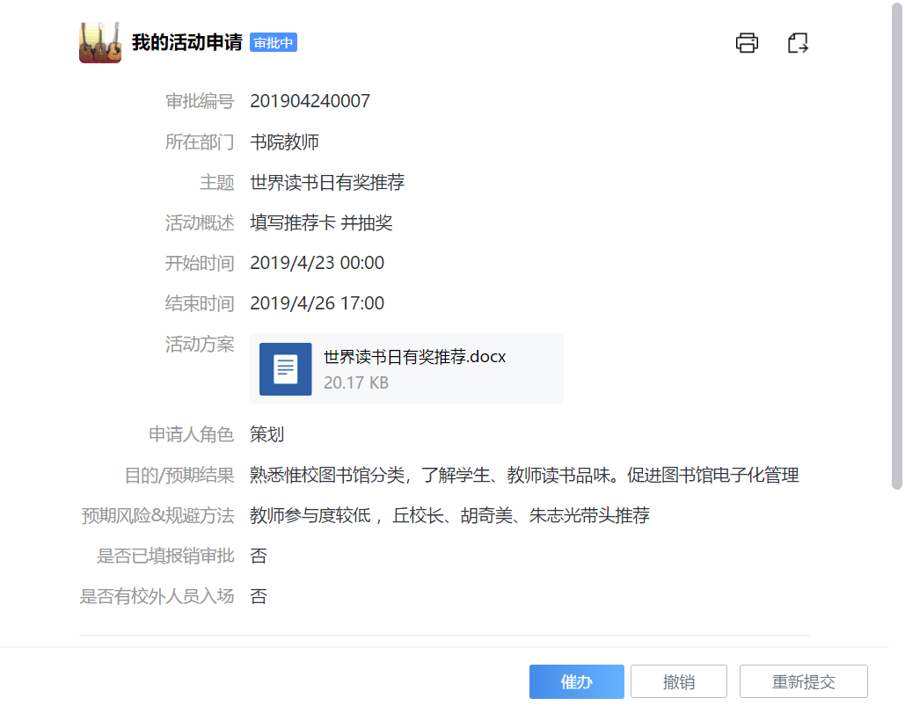
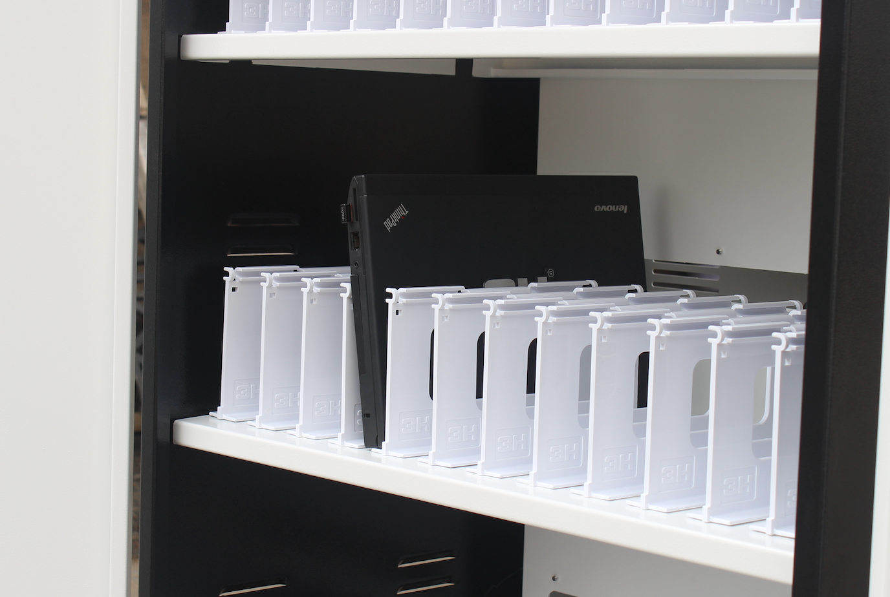
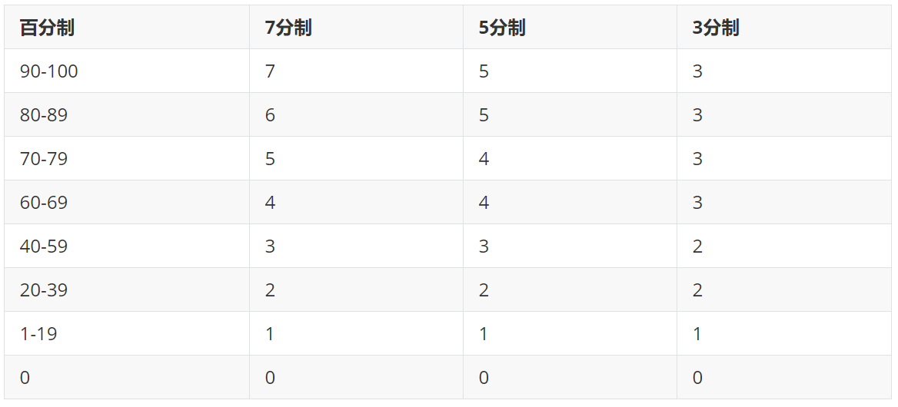
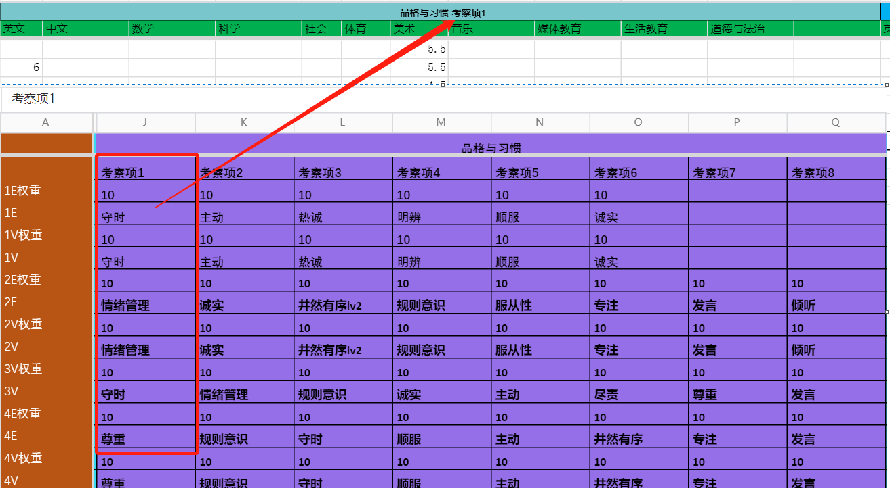
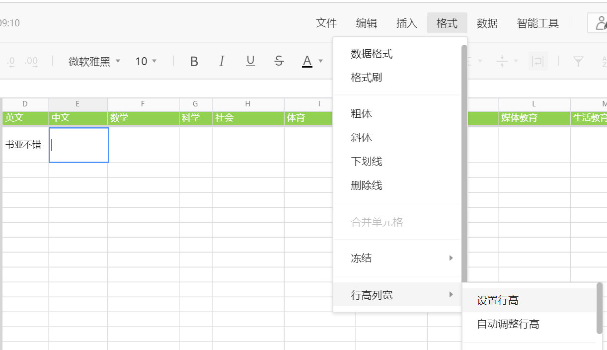
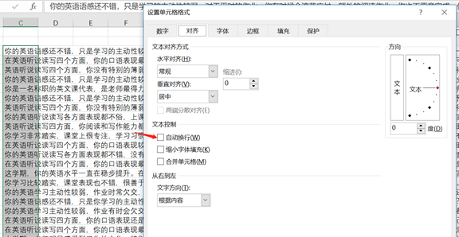
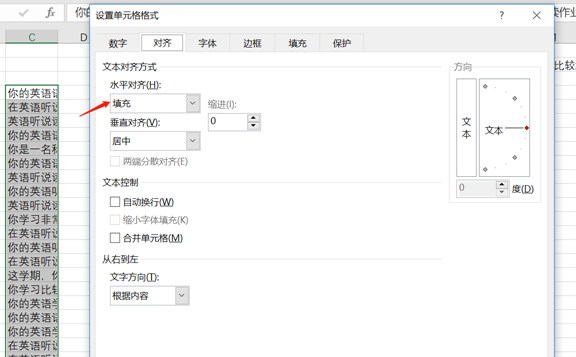

# 概述

学校的`行政`工作通常会划分为`后勤/教辅/教务`：

- 从HR角度，一方面要考虑挽留策略，另一方面需要考虑 工作内容的可交接性（每个人都需要是可替代的）；
- 每年/半年召开一次后勤动员会；


我们也按这三个类别涉及到的`IT单元`进行规划：

- `后勤`：
  - 职责：提供`教职工`教学/办公所需的`物资`的，制定`必要的审批流程`保障企业成本；
  - 重点：配合管理校园资产表（以期管理并减少资产浪费），与`财务`对接规则；
- `教辅`：
  - 职责：
    - 协助`教师`课业以外的教学辅助，如：
      - 学生心理辅导
      - 家长信息管理（如接待、访谈收集）
      - 学生信息管理（如学生诚信、态度类事件）
      - 培训交流
    - 协助`学生`提高学习的辅助系统，如：
      - 云课堂：即以课堂录播重放为中心；
      - 图书馆：拓展世界视野；
  - 重点：围绕各类信息收集的电子化收集：包括`图书馆电子借阅系统`、教师通道，`学生管理系统`；
- `教务`：
  - 职责：制定`教学计划`，`课程培养方案`，以及`教学方案`
  - 重点：


## tips：

处于IT建设初期的行政人员，往往期望大刀阔斧的对消耗教师职工较大精力进行改革。企图借鉴主流的`财务`/`物业`行业的IT实践经验，利用尽可能的`IT基础设施/规范` 来提高便捷的资源共享以及业务能力。

但请小心：

- 所有`IT组`以外的教职工可能对IT系统、软件操作等都不是很内行。
- 即使你提供了文档、操作视频，他们也很可能无法第一时间进行学习培训。
- `任何微乎其微的学习成本`都会对他们产生许多心理压力，需要`IT组`能温柔的对待他们。

一个各行业最佳实践：

在考虑`变革既有系统`时，尽可能的先同时保留`既有系统`（即双系统并行），动员他们中间对`IT系统`比较内行的人先尝试新的变化，大家看到`新IT系统`的好处时，自然就会学习过渡到新系统。


# 后勤

- 机房网络设备


- 办公耗材
  - 打印机自动加墨
  - 桌面插排数不足
  - 办公电脑系统卡顿

- 资产编号

  - 如资产室编号：A203，G203；
  - 如售后联系：

- 财务

  - 颁布《申购&报销》审批办法
- 后勤&安保
  - 启动Q&A表单跟踪事务；
  - 校门口停车问题；
  - `hikivision`设备提供人脸识别
    - 识别签到：包括`校内`在内的任何人，也包括`不良人员`，需要收集校内`人脸数据`。
    - 后期可对热点图，路径图，画像，SKU算法的进行`行为分析`：
      - 如对厕所不冲水的人（进出摄像头视野`>10min`）进行分析；
      - 如对图书馆乱放书的行为分析；


## 教辅

- 教师管理
- 学生管理
- 课程管理
- 活动管理
- 图书馆
- 门户

- 集体备课系统（英语）
  - 《年度教学计划》
  - 《备课教案》

- 活动管理
  - 年度活动计划


# `2019.1学期`重点IT

- 基础设施：

  - 网络布线拓扑

    - 明确`机房管理办法`，在主路由器配置`网络使用策略`；
      - 网络设备
  - 监控 (datasource)

  - 图书馆机房

    - 安排10台`树莓派`与`显示器`供学生查询使用，调整网络后禁止学生携带个人电子设备入校；


- 财务：

  - `报销`：与会计协定 认可的`企业微信审批单`，`手写审批单`不再是必须凭证；
  - 制定了统一的`资产管理清单`，避免重复购买；


- 教务：

  - 训辅：制定`个例分析报告模板`，需要考察的`维度`，周例会的汇报人需要填报`学生事件`；

    - 对于开放的 `open` 状态的`issue`，确保每周有`跟进机制`；
    - 汇报发起人跟踪直至个案`close`，并提交`XX-XXX-个例分析报告`；

  - 活动部：

    - 企业微信制定了`活动审批`进行`活动管理`以及review；

      

  - 逐渐转移`ruianva.cn`招生入口进行；

- 教辅：
  - 图书馆：
    - 创建基于`惟校学号`的自助式`图书借阅程序`，解放行政力量，更多参与到书单选购事宜；
  - portal：`ruianva.cn` portal的招生工作；


## 温州中学

- 机房/机房：
  - 网络监控 sangfor，放在核心交换机前；
- 图书馆/IC卡系统：
  - 浙江正远；
  - [瑞章](http://www.ruizhangtech.com/public/index.php/index/about/introduce?id=1)
- 讯飞
- 校园教务系统：
  - 管理数据库系统表结构；
  - 图书馆系统表结构；
- 教师辅助：
  - 网络备课->改卷系统；


# IT培训

为什么使用markdown?


# IT基础设施

- 智能锁（门禁）

  - 门禁规则：非工作时间大门超过2分钟

    

- 打铃机

`zhongjinaozhongmianfeiban.APK` 终极闹钟免费版，还原

- 桌面云
- 流媒体服务
- 协同办公服务


## 流媒体服务


- 方案一： DV现场（含现场互动）

DV -> OBS STUDIO -> 万股

OBS STUDIO显示器 游戏黑屏

WIN->设备管理器，界面拉到底下有一个显示适配器

一个是集成显卡，一个是独立显卡。你禁用独立显卡就好了。 录好视频后启动再启用独立显卡。


- 方案二：屏幕（纯技术培训类）

  

  

# 環境設定

1. 安裝 OBS
2. 安裝 OBS-NDI
   1. 會要求安裝 [ NDI 3.0 Runtime](http://new.tk/NDIRedistV3)
3. 安裝 [NewTek Tools](https://www.newtek.com/ndi/tools/) ，只需要安裝 portable 版本即可，我們只需要 NDI Studio Monitor

當安裝完以上的東西後，應該會被要求重啟電腦。電腦重新啟動後，就可以打開 OBS 的程式

1. 在 Tools 的地方，點選 NDI Output settings

[](https://i.imgur.com/cjOOe7P.png)

1. 勾選 【Enable NDI Output】

[](https://i.imgur.com/07VTll2.png)

1. 這樣 OBS 就會將你的訊號，用 NDI 的模式發送出去，只要在你的**區域網域**內，支援 NDI Input 的軟體或導播機，都可以搜尋的到

2. 開啟【NewTek NDI Studio Montiro】

   [](https://i.imgur.com/EocvMNA.png)

3. 選擇訊號來源

[](https://i.imgur.com/QLTueoJ.png)

1. 檢視 OBS NDI 訊號輸出結果

   [](https://i.imgur.com/PvcqWiC.png)

2. 由於我們要將這一個視窗透過 ZOOM 分享的方式，顯示給其他與會者看。所以還有兩個地方要做調整

   1. 視窗的 border 要隱藏

      [](https://i.imgur.com/uZsxSas.png)

   2. 聲音音量的顯示，要將 VU Meter 關掉

      [](https://i.imgur.com/8PASrQp.png)

3. 完成設定，剩下的就是用 Zoom 分享這一個視窗應用程式

這裡要注意一點，當你點選 Hide Window 時，該視窗就無法再移動了，所以如果有第二顆螢幕或是第二台電腦時，這一個分享的動作，可以在另外一個地方進行。


https://github.com/Palakis/obs-ndi/releases/tag/4.6.0


## 校园服务器

2U刀片服务器，可以逐步升级，以128GB/千兆开始，CPU宜配好一点的；

61700(256GB)

56000(192GB) 

相差= 5700  元， 相当于一跟内存 2850元/32GB

50900


- 配置:

  - cpu: epyc 7351*2  
  - ram: 224g  

  - 存储：
    - 数据盘：sata hdd: 4t*4   ssd: 480g*2  
    - OS盘：BOSS 控制器卡 + 含 2 M.2 Sticks 240G (RAID 1)

  - 网卡：双口10ge，电口
  - raid卡：支持并行raid5，如h730p


功能1： 教学服务：

- 桌面云，后期信息技术课统一管理学生终端，可创建30-50台WIN7虚拟机，学生通过树莓派连接到桌面云; 

功能2：行政/教学服务：

- 教师流媒体服务器，采购后下学期，搭建课堂录播流媒体服务；

- 教师协同办公服务，目前使用的免费网络共享有较大限制，服务器采购后使用Only office服务；

- 教师文件管理服务，目前使用的公用电脑存储较少，服务器采购后使用Nextcloud 文件管理服务。

  

- 服务器cpu、内存、磁盘价格基本平稳（其中服务器内存价格3年稳定）；

- 中美贸易战背景下，cpu有较大涨幅可能，下学期有较大可能开`信息技术`课程；


## 机房解决方案

- VDI（Virtual Desktop Infrastructure）：虚拟桌面设施；

  

  `锐捷RCD6000-Main`可以支持50个VDI终端+3200个IDV终端；

客户端可考虑[HP mt44](https://www8.hp.com/us/en/thin-clients/mobile/mt44.html?jumpid=in_r11260_us/en/psg/hp_thin_clients/os-windows-embedded-mt44)，[lenovo ideapad d330](http://detail.zol.com.cn/notebook/index1231701.shtml)

移动机柜方面：[玺瑞中泰笔记本充电柜](https://item.taobao.com/item.htm?spm=a1z10.5-c-s.w4002-19007023971.21.5ed425c8pnBTeC&id=581393212553) 支持`机柜背后有插座，统一可放适配器的位置`*30；

- TYPEC充电[笔记本](https://baijiahao.baidu.com/s?id=1619720632244494136&wfr=spider&for=pc)

三星笔记本9

Spectre x2

Apple MacBook Pro




## KVM+Spice

[Spice](https://gitlab.freedesktop.org/spice/spice)更新再次启动

基于开源协议优化的桌面虚拟化厂家，如`深信服、锐捷、青葡萄`等。这些厂家的特点是使用开源的KVM虚拟化系统和SPICE协议，对虚拟化系统和SPICE协议做了一些增强。通常提供从硬件基础设施、桌面虚拟化软件、云终端的整套解决方案。


专注于桌面虚拟化管理的桌面虚拟化厂家，如`杰云科技、晨云、武汉噢易`等。这些厂家的特点是支持多种桌面虚拟化系统和桌面协议，可以选用商用的虚拟化平台。  


http://www.jieyung.com/articles/shownews.php?lang=cn&id=73

http://bbs.51cto.com/thread-1547675-1.html

USB重定向


## mstsc(rdp) / vnc

| Software                                  | Protocol          | License     |
| ----------------------------------------- | ----------------- | ----------- |
| Citrix XenApp                             | RDP, ICA          | Proprietary |
| FreeNX                                    | NX, RDP, RFB(VNC) | GPL         |
| LogMeIn                                   | Proprietary       | Proprietary |
| Neatx                                     | NX                | GPL         |
| rdesktop                                  | RDP               | GPL         |
| RealVNC                                   | RFB(VNC)          | GPL         |
| UltraVNC                                  | RFB(VNC)          | GPL         |
| Remote Desktop Services/Terminal Services | RDP               | Proprietary |
| SSH with X forwarding                     | X11               | BSD         |
| Symantec pcAnywhere                       | Proprietary       | Proprietary |
| Citrix XenAppRDP                          | ICA               | Proprietary |

[发展路径](https://www.cnblogs.com/coderzh/archive/2010/09/24/thinclient-protocol.html)

## 配置

- 服务端：
  - 服务器：Dell PowerEdge R730(INTEL)/7425(AMD) ，4w元左右
  - 软件：
    - os：Windows Server 2012R2 DataCenter (支持无限台虚拟机Hyper-V) 正版授权价格3000美元左右；
    - 云桌面服务端：[Deskpool 3.1 For Hyper-V 试用版](https://vdi-1251215814.cos.ap-guangzhou.myqcloud.com/deskpool/Deskpool_Hyper-V_2012R2_V3_1_0.msi) 0元；
  - 总计：6万左右

- 客户端方案1：
  - 主机：树莓派3b+：300元； 
  - 键鼠套装：罗技 MK200 80元；

    

- 客户端方案2：

  - 轻薄型笔记本：2500元

    

- 电脑

|        | 方案1                                                        | 方案2               |
| ------ | ------------------------------------------------------------ | ------------------- |
| 主机   | 树莓派3b+                                                    | 轻薄型笔记本 2500元 |
| 外设   | 罗技 MK200 80元                                              |                     |
| 显示器 | [AOC I2080SW](http://detail.zol.com.cn/lcd/index402966.shtml) 500元 |                     |
| 优点   | 显示器较大，价格实惠，硬件维护成本低                         | 便于运输            |
| 弱点   | 不利于运输                                                   | 硬件、维护成本较高  |

- 客户端软件：

  - os：android 7.0/ centOS 6.6 (免费)
  - 云桌面客户端：云杰瘦客户端os (JYOS)  (免费)

树莓派3b+配置

```
博通BCM2837B0 SoC，集成四核ARM Cortex-A53（ARMv8）64位@ 1.4GHz CPU，集成博通 Videocore-IV GPU
内存：1GB LPDDR2 SDRAM
有线网络：千兆以太网（通过USB2.0通道，最大吞吐量 300Mbps）
无线网络:2.4GHz和5GHz 双频Wi-Fi，支持802.11b/g/n/ac
蓝牙：蓝牙4.2&低功耗蓝牙（BLE）
存储：Micro-SD
其他接口：HDMI，3.5mm模拟音频视频插孔，4x USB 2.0，以太网，摄像机串行接口（CSI），显示器串行接口（DSI），MicroSD卡座，40pin扩展双排插针
尺寸：82mmx 56mmx 19.5mm，50克

--300元
```

- [J35N](https://item.taobao.com/item.htm?spm=a1z10.5-c.w4002-5489146991.6.4b732dccD9MuQ4&id=569798740397)

```
--360元且带软件 瘦客户机（云终端）软件系统
另外还提供免费版license
http://www.jieyung.com/product/showproduct.php?id=79
ARMV8 2.0GHz
DDR3 1866:512MB
闪存：4GB
```

- 远程控制

http://i.youku.com/jieyung

### 服务器

推荐型号：DELL R730 /R7425（AMD 霄龙 7000）最大内存1.5T（64GB * 24）

|              | 30用户                             |      | 50用户                             |
| ------------ | ---------------------------------- | ---- | ---------------------------------- |
| cpu          | E5-2620V4 2.1Ghz x 2               |      | E5-2630V4 2.2Ghz x 2               |
| ram          | 128GB(16GB DDR4 * 8)               |      | 224GB(32GB DDR4 * 7)               |
| data storage | 4TB * 4 (7.2K)                     |      | 4TB * 2(7.2K)                      |
| os storage   | 240G SSD * 2 [Intel S4500/S3520]   |      | 240G SSD * 2 [Intel S4500/S3520]   |
|              | SSD：480GB * 2 [Intel S3510/S3520] |      | SSD：480GB * 2 [Intel S3510/S3520] |
| 网口         | GE*4                               |      | GE*4                               |
| 电源         | 双电源                             |      | 双电源                             |

### 沙巴克

`R730XD 2620V42 /16GB/4T SAS4+240G SSD2+480G SSD2/H730P/750W2/导轨  38500`

`RS720A-E9 RS24   7351P*2  224G   4t*4 240G*2   480G*2   双电   45900`


[AMD 霄龙 7351p](http://detail.zol.com.cn/servercpu/index1174576.shtml)


- 2个480G SSD与4个4TB SATA构成分层存储，采用Mirror模式，提供大约8TB的有效存储空间。分层存储是利用Windows Server 2012R2的Storage Space特性实现的。该特性可以混合使用SSD和HDD，提供分层存储的能力。热点数据保存在SSD(OS使用)。从而实现HDD的容量，和接近SSD的IO性能。

[内存区别](https://www.idcbest.com/servernews/11002265.html)


## 测试环境安装

[官方文档](http://www.jieyung.com/service/show.php?id=169)：1493895271.pdf

### 部署服务器Windows Server 2016R2 DataCenter 

Microsoft Hyper-V Server 2016 is a stand-alone product that contains only the Windows hypervisor, a Windows Server driver model, and virtualization components. 

- 保守点，安装2012 os算了：
- [Hyper-V Server 2016](http://blog.51cto.com/wuyvzhang/2087537)
  - [WS闭坑指南](https://post.smzdm.com/p/574836/) 
    - 下载：http://www.imsdn.cn/operating-systems/windows-server-2016/

- 镜像下载 WIN7x86img.zip

- [批量创建虚拟机](http://blog.51cto.com/biwei/2308671)


## Deskpool for Hyper-V 

- [下载](http://www.jieyung.com/software/showdownload.php?id=62)：
- Deskpool_Hyper-V_2012R2_V3_1_0.msi

免费版：不允许使用用户数据盘：


# 惟校编号

内部编号，常用于如下领域：

- 学生看版
  - 成绩登记
  - 期末手册
- 图书借阅
- 校园超市等


使用标准IC卡`85.6×53.98 mm`制作实体卡；

- 具体设计规格如下:
  - `二维码粘 40mm*20mm`
  - `防水挂脖卡牌`

    - `规格2: 71mm * 99mm `

      


学号编号规则：

- `180101`：`唯一编号`，为方便记忆，暂以`一年级对应入学年`+`班级号`+`班级序号`，换班、留级、跳级惟一号都不进行修改；

- [具体学号清单如下](https://shimo.im/sheet/lbJ0v4vtxg8z0G88/veCwB)：


## 校园卡

制作标准IC卡

- 1.是否买制卡设备，利：信息安全性好，后期补卡方便；弊：需专门维护一个打印设备，管理耗材；

- 2.批量对学生拍摄，关联二维码；

  - `找一个靠谱的打印店，形成长期密切的合同，可以贵一点，但是品质不能差。`
  - 金龙广告： 133 5338 5533


制作一个二维码贴

- 贴在姓名
- 


叶文博

蔡铭泽


## 相关程序/脚本

- 编号生成

```perl
perl -e 'for ( 1..1000 ) {$num=(sprintf "%07d", $_);print "$num\n";}' #图书馆
perl -e 'for my $year(12..20) for my $class(1..3) {for ( 1..36 ) {$num=(sprintf "%02d", $year).(sprintf "%02d", $class).(sprintf "%02d", $_);print "$num\n";}}' #学号
```

- `OfficeAutoService.groovy`报告单程序

  


# 学生看板

- 预警信息：红/黄/绿

- 维度：

  - 课堂表现
  - 近2学期体育成绩
  - 班级总成绩排名
  - 历史奖惩
    - 积分
    - 鼓励信、礼仪之星；
  - 身体健康状况；
  - 家庭属性；
    - 家访时间表；
  - 学习态度；
    - 抄袭事件
  - 信用；
    - 撒谎事件
    - 抄袭事件

  


# 报告单数据收集

报告单，就是学生的学期评价表，打分通常有如下几种打分方法：

- 3分：优异、尚可、不达标

- 5分：优、良、常、可、不达标

- 7分：`4分`为及格线，`7分`为满分；

  

使用7分制评分（以0.5分间隔进行打分）+建设性评语；



- 每个`科目`由**最多**8个的`1级考察项`构成，如：

  - 小学科目`品格与习惯`，由`井然有序,自制,专注,感恩,尊重,尽责,课前准备,发言 ,善于倾听,自我调节,服从性`构成；

- 每个`1级考察项目`可进一步由最多12个`2级考察项`构成：

  - 如科目`品格与习惯`的1级考察项`井然有序`由`11个科任老师评定`构成；


各班主任网络共享表格作为数据源收集，类似大家熟悉的EXCEL；

进而通过一组docx4j程序批量导出文档的工具；

## 🔗链接

- [打分表](https://docs.qq.com/sheet/DWGVsbXBLVkR6YnBB?opendocxfrom=admin&tab=BB08J2&coord=D10%24D10%243%240%24184%240)

- [词汇表](https://docs.qq.com/sheet/DWGV4ZGlYcWh2ZnN2?opendocxfrom=admin&tab=BB08J2&coord=A1%24A1%240%240%241%240)

  

## 填写流程介绍

- 配置较差的电脑使用`网络共享表格`会比较卡，各教师尽量在自己本地编辑好再粘贴到`共享表格`；

  （**需登陆`企业微信`才能输入**）；

- 关于评语：

  - 用`鼓励`代替`赞美`：
    - 如`积极活跃`、`充满活力`等代替`活泼可爱`；
    - 用`快速反应`，`有潜力`等代替`聪明`、`有天赋`。
  - 不用`老师喜欢你......`这样的句式，以免造成给孩子要`取悦他人`的错误观念；
    - 可以改为“老师欣赏你的认真”，
    - “你认真上课的状态，让老师也感到被尊重”，
    - “老师谢谢你的帮忙”等。
  - 注意`“的”`、`“地”`、`“得”`的使用；
  - 注意标点符号的使用。

- 关于打分

  - 以7分满分，0.5为最小单位；
  - 建议先在本地电脑Excel处理好，然后在粘贴上去比较方便；

- `1级考察项打分表` 

  - `科目栏`：
    - 初中顺序：`英文 中文 数学 科学 社会 体育 美术 音乐`；8
    - 小学顺序：`技能 品格与习惯 作业 英文 中文 数学 科学 社会 体育 美术 音乐 媒体教育`  ；3+9

- `2级考察项打分表`：

  - 当前仅对`小学班级`使用，即`技能 品格与习惯 作业`考察项的进一步细化打分项（由相关各科老师进行打分表）；

  

- 网络共享表格常用快捷键

  - 按比例放大收缩：`ctrl + +/-`


## Q&A

### 评语段内容导致单元格高度变长



- 在Excel内是这样设置的：

  - 内容太多，导致纵向拉太长

    

  - 横向超长，挡住旁边的单元格。（网络共享不具备这个功能）

   

## [docx4j](https://53873039oycg.iteye.com/blog/2339120)

程序思路是通过一组hashmap，

每个年级对学生的评估都不一致，如何能在一张表格中体现呢：


```groovy
static int SUBJECT_DIM1_NUM = 8 // 1级考察项
static int SUBJECT_DIM2_NUM = 14 // 2级考察项
static int SUBJECT_DIM1_SUM_NUM = 4 // 总评 评语
static int SUBJECT_DIM1_ALL_NUM = SUBJECT_DIM1_NUM + SUBJECT_DIM1_SUM_NUM // 总评 评语
static int META_COL_NUM = 6 // 姓名等其他元数据项
static def metas = [:]
static def qualitySubjects = "技能 品格与习惯 作业".split(/\s/)
```

//对于s3

```
mergeSubjects // 对于>8个1级考察项的合并处理
qualitySubjectItemIndex // 对于2级考察项的序列统计

def qualitySubjectItemIndex = qualitySubjectItemHash[qualitySubjectItem] //前后相串
```


### BI

在数据库里最方便的也应当是一个横表，`ID / DIM_NAME / DIM_VALUE`

目前我们的科目成绩(学科/技能/作业/品格与习惯) 结构如下： 科目成绩-> 1级考察项 -> 2级考察项。（其中2级考察项目，仅小学涉及，为各个老师对1级考察项的明细打分）

[rollup](https://blog.csdn.net/u012388497/article/details/45577673)

[树形下钻](http://lxw1234.com/archives/2015/04/193.htm)

[FINEREPORT](https://www.zhihu.com/question/41526815)

```sql
select sum(value*weight) / sum(case when value is not null then weight else 0 end)
```

- 180101 Joshua 技能 
  - 想象力
    - 语文
    - 数学
    - xx
    - xx
  - 思考
    - XX
    - XX


STUNO SEMESTER SUBJECT DIM1 WEIGHT DIM2

18101 18-1

## word2pdf

[DOCX 2 PDF](https://www.cnblogs.com/Mr-nie/p/8029085.html)


# 会议/汇报跟踪

在网络共享上企业内部全员`可读/写`、`安全`、`免费的`会议一栏，并通过`跟踪闭环表`确保事后回顾(after action review)；

会前：

- owner记录会议/报告的`主题`、`纪要`（网络共享）
- 微信群通知时间（15min~1.5h为宜)通知与会人员会议id，；


会后：

- `问题提出人`记录闭环跟踪表；
- `问题跟踪/评价人`判断问题`是否需要执行`，以及`原因`；
  - 若问题需要执行，则问题`优先级`、计划完成时间；
  - 若问题不需要执行，则后续流程`终止`；
- `问题负责人`再解决问题后，记录`实际完成时间`以及`问题解决情况`、以及`输出物`；
- `问题跟踪/评价人`判断问题`问题状态`、以及`评价`，`下一步工作`


会中：

- 期望发生

- 实际发生

- 差异分析
- 下一步怎么做


- 会议类型：
- 时间：
- 地点：
- 通知人员：
  - 缺席人员：

- 主题(subject)：
- 纪要(agenda)：
  - topic1：
  - topic2：
- 标记事宜：
  - 跟踪：
    - owner
  - todo：
    - owner


