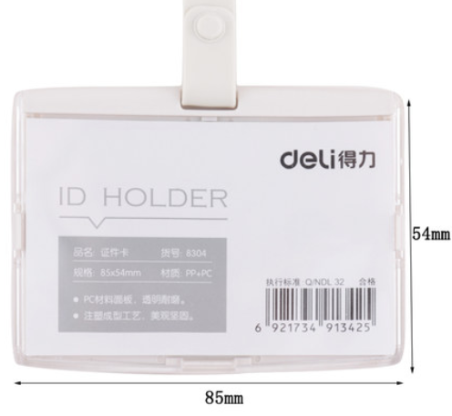

# 惟校IT建设

以`nonaggressive/黑盒`模式（最小化改变当前现状方式提高业务提升）进行整改，以提高整体运转效率。

2019.1学期涉及的重点IT：

- 行政：
  - `机房管理员`明确`机房管理办法`，在主路由器配置`网络使用策略`；

    - 监控机，`hikivision`购买具备人脸识别，可针对性进行`行为分析`：
      - 如对厕所不冲水的人（进出摄像头视野`>10min`）进行分析；
      - 如对图书馆乱放书的行为分析；
  - 简化财务流程（done）：
    - `报销`统一`企业微信报销审批`，`取消` `手写审批单`流程；
    - `学期申购`统一走公共表格`资产管理清单`；

      - `取消`学期内`行政人员`申购方法；

        
- 教务：
  - 社会课：
    - 在图书馆安排8台`树莓派`与`显示器`供学生查询使用；
  - 训辅：制定`个例分析报告模板`，需要考察的`维度`，周例会的汇报人需要填报学生事件提供维度。
    - 对于开放的 `open` 状态的`issue`，确保每周有`跟进机制`；
    - 汇报发起人跟踪直至个案`close`，并提交`XX-XXX-个例分析报告`；
  - 招生方面：逐渐转移`ruianva.cn`招生入口进行；
    - `openning day`：制定统一`企业微信审批`；
- 教辅：
  - 图书馆：
    - 创建基于`惟校学号`的自助式`图书借阅程序`，解放行政力量，更多参与到书单选购事宜；
  - portal：`ruianva.cn` portal的招生工作；

## 可外包

- 机房/机房：
  - 网络监控 sangfor，放在核心交换机前；
- 图书馆/IC卡系统：
  - 浙江正远；
- 校园教务系统：
  - 管理数据库系统表结构；
  - 图书馆系统表结构；
- 教师辅助：
  - 网络备课->改卷系统；


## 计划

1. 图书管理系统；
2. 


# 人人都懂Markdown

## 为什么使用markdown

- `markdown`是一组标记文档的语言，旨在将用户的精力聚焦在编辑文档的`逻辑`、`层次`内容上，而非浪费在`格式展示`、`美化排版`(这部分的工作被剥离成独立的`格式模板`由大量社区美工提供)，`markdown`几乎是所有主流IT社区撰写博客的默认语言；
- 任何`文字工作者`（尤其是`IT工程师`、`教师`、`作家`、`图书馆编辑`）都将从使用markdown中获得如下好处：

  - 基于纯文本编辑器，快速遍历检索：

  - 配合使用git/svn，可以十分方便的追溯你的编辑历史；
  - 海量精美模板，直接生成排版好的文档；
  - 开源社区开发了大量基于markdown拓展工具
    - 制作wiki手册: gitbook/docsify
    - 格式转换工具，快速导出各类格式：docx/chm/pdf/html

  

几乎所有的现代程序员编辑器(sublime/vscode/atom...)都支持markdown编写、预览；


## typora

一款免费、支持`mac`/`linux`/`windows`系统的文档编辑器；

- 逐渐取代word的功能；

  


## 移动机房

- VDI（Virtual Desktop Infrastructure）：虚拟桌面基础架构；

- IDV（ Intelligent Desktop Virtualization）：智能桌面虚拟化；(胖客户端方案)；

`锐捷RCD6000-Main`可以支持50个VDI终端+3200个IDV终端；

客户端可考虑[HP mt44](https://www8.hp.com/us/en/thin-clients/mobile/mt44.html?jumpid=in_r11260_us/en/psg/hp_thin_clients/os-windows-embedded-mt44)，[lenovo ideapad d330](http://detail.zol.com.cn/notebook/index1231701.shtml)

移动机柜方面：[玺瑞中泰笔记本充电柜](https://item.taobao.com/item.htm?spm=a1z10.5-c-s.w4002-19007023971.21.5ed425c8pnBTeC&id=581393212553) 支持`机柜背后有插座，统一可放适配器的位置`*30；

- TYPEC充电[笔记本](https://baijiahao.baidu.com/s?id=1619720632244494136&wfr=spider&for=pc)

三星笔记本9

Spectre x2

Apple MacBook Pro


### 方案

- KVM+Spice

[Spice](https://gitlab.freedesktop.org/spice/spice)更新再次启动

基于开源协议优化的桌面虚拟化厂家，如`深信服、锐捷、青葡萄`等。这些厂家的特点是使用开源的KVM虚拟化系统和SPICE协议，对虚拟化系统和SPICE协议做了一些增强。通常提供从硬件基础设施、桌面虚拟化软件、云终端的整套解决方案。


专注于桌面虚拟化管理的桌面虚拟化厂家，如`杰云科技、晨云、武汉噢易`等。这些厂家的特点是支持多种桌面虚拟化系统和桌面协议，可以选用商用的虚拟化平台。  


http://www.jieyung.com/articles/shownews.php?lang=cn&id=73

http://bbs.51cto.com/thread-1547675-1.html

USB重定向

## 配置

- 网络：
  - 方案一：无线路由器方案
    - 企业级无线路由器：飞鱼星VW1200 550元

- 服务端：
  - 服务器：Dell PowerEdge R730 (E5-2650V4 2.2Ghz x2 ,128gb ram , 8TB disk) 4w元左右
  - 软件：
    - os：Windows Server 2012R2 DataCenter (支持无限台虚拟机Hyper-V) 正版授权价格3000美元左右
    - 云桌面服务端：[Deskpool 3.1 For Hyper-V 试用版](https://vdi-1251215814.cos.ap-guangzhou.myqcloud.com/deskpool/Deskpool_Hyper-V_2012R2_V3_1_0.msi) 0元
  - 总计：6万左右

- 客户端方案1：
  - 主机：树莓派3b+：300元； 
  - 键鼠套装：罗技 MK200 80元；
  - 显示器：[AOC I2080SW](http://detail.zol.com.cn/lcd/index402966.shtml) 500元
  - 总计：880 * 30 = 26400元

- 客户端方案2：

  - 轻薄型笔记本：2500元

  - 总计：2500* 30 =7.5w元

    

- 电脑，

|        | 方案1                                                        | 方案2               |
| ------ | ------------------------------------------------------------ | ------------------- |
| 主机   | 树莓派3b+                                                    | 轻薄型笔记本 2500元 |
| 外设   | 罗技 MK200 80元                                              |                     |
| 显示器 | [AOC I2080SW](http://detail.zol.com.cn/lcd/index402966.shtml) 500元 |                     |
| 优点   | 显示器较大，价格实惠，硬件维护成本低                         | 便于运输            |
| 弱点   | 不利于运输                                                   | 硬件、维护成本较高  |

- 客户端软件：

  - os：android 7.0/ centOS 6.6 (免费)
  - 云桌面客户端：云杰瘦客户端os (JYOS)  (免费)

树莓派3b+配置

```
博通BCM2837B0 SoC，集成四核ARM Cortex-A53（ARMv8）64位@ 1.4GHz CPU，集成博通 Videocore-IV GPU
内存：1GB LPDDR2 SDRAM
有线网络：千兆以太网（通过USB2.0通道，最大吞吐量 300Mbps）
无线网络:2.4GHz和5GHz 双频Wi-Fi，支持802.11b/g/n/ac
蓝牙：蓝牙4.2&低功耗蓝牙（BLE）
存储：Micro-SD
其他接口：HDMI，3.5mm模拟音频视频插孔，4x USB 2.0，以太网，摄像机串行接口（CSI），显示器串行接口（DSI），MicroSD卡座，40pin扩展双排插针
尺寸：82mmx 56mmx 19.5mm，50克

--300元
```

- [J35N](https://item.taobao.com/item.htm?spm=a1z10.5-c.w4002-5489146991.6.4b732dccD9MuQ4&id=569798740397)

```
--360元且带软件 瘦客户机（云终端）软件系统
另外还提供免费版license
http://www.jieyung.com/product/showproduct.php?id=79
ARMV8 2.0GHz
DDR3 1866:512MB
闪存：4GB
```

- 远程控制

http://i.youku.com/jieyung

### 服务器

推荐型号：DELL R730 /R7425（AMD 霄龙 7000）最大内存1.5T（64GB * 24）

|              | 30用户                             | 50用户                             |
| ------------ | ---------------------------------- | ---------------------------------- |
| cpu          | E5-2620V4 2.1Ghz x 2               | E5-2630V4 2.2Ghz x 2               |
| ram          | 128GB(16GB DDR4 * 8)               | 224GB(32GB DDR4 * 7)               |
| data storage | 4TB * 4 (7.2K)                     | 4TB * 2(7.2K)                      |
| os storage   | 240G SSD * 2 [Intel S4500/S3520]   | 240G SSD * 2 [Intel S4500/S3520]   |
|              | SSD：480GB * 2 [Intel S3510/S3520] | SSD：480GB * 2 [Intel S3510/S3520] |
| 网口         | GE*4                               | GE*4                               |
| 电源         | 双电源                             | 双电源                             |


- 2个480G SSD与4个4TB SATA构成分层存储，采用Mirror模式，提供大约8TB的有效存储空间。分层存储是利用Windows Server 2012R2的Storage Space特性实现的。该特性可以混合使用SSD和HDD，提供分层存储的能力。热点数据保存在SSD(OS使用)。从而实现HDD的容量，和接近SSD的IO性能。

[内存区别](https://www.idcbest.com/servernews/11002265.html)


## 测试环境安装

[官方文档](http://www.jieyung.com/service/show.php?id=169)：1493895271.pdf

### 部署服务器Windows Server 2016R2 DataCenter 

Microsoft Hyper-V Server 2016 is a stand-alone product that contains only the Windows hypervisor, a Windows Server driver model, and virtualization components. 

- 保守点，安装2012 os算了：
- [Hyper-V Server 2016](http://blog.51cto.com/wuyvzhang/2087537)
  - [WS闭坑指南](https://post.smzdm.com/p/574836/) 
    - 下载：http://www.imsdn.cn/operating-systems/windows-server-2016/

- 镜像下载 WIN7x86img.zip

- [批量创建虚拟机](http://blog.51cto.com/biwei/2308671)


## Deskpool for Hyper-V 

- [下载](http://www.jieyung.com/software/showdownload.php?id=62)：
- Deskpool_Hyper-V_2012R2_V3_1_0.msi

免费版：不允许使用用户数据盘：


# 惟校学号

`校内学号`常用于如下领域：

- 学生看版
  - 成绩登记
  - 期末手册
- 图书借阅
- 校园超市等


- 目前设计规格如下:
  - `二维码粘 40mm*20mm`
  - `防水挂脖卡牌`
    - `规格1: 54mm * 85mm `
    - `规格2: 71mm * 99mm `
    - `规格3: 106mm * 63mm `
    - `规格4: 85mm * 54mm`;





学号编号规则：

- `180101`：`唯一编号`，为方便记忆，暂以`一年级对应入学年`+`班级号`+`班级序号`，换班、留级、跳级惟一号都不进行修改；

- [具体学号清单如下](https://shimo.im/sheet/lbJ0v4vtxg8z0G88/veCwB)：


## 学生看板

- 预警信息：红/黄/绿

- 维度：

  - 学科成绩、排名情况；
  - 身体健康状况；
  - 家庭属性；
    - 家访时间表；
  - 学习态度；
    - 抄袭事件
  - 信用；
    - 撒谎事件
    - 抄袭事件

  


# 常用脚本

- 编号生成

```perl
perl -e 'for ( 1..1000 ) {$num=(sprintf "%07d", $_);print "$num\n";}' #图书馆
perl -e 'for my $year(12..20) for my $class(1..3) {for ( 1..36 ) {$num=(sprintf "%02d", $year).(sprintf "%02d", $class).(sprintf "%02d", $_);print "$num\n";}}' #学号
```


# 报告单数据收集

我们使用石墨表格作为数据源收集，类似大家熟悉的EXCEL；

进而通过一组docx4j程序批量导出文档的工具；

## 🔗链接

- [1V](https://shimo.im/sheet/HpDnaQLa6WEuLAxt/ ) [1E](https://shimo.im/sheet/s94f7WFYfsc3TJF2/) [2V](https://shimo.im/sheet/XqABNQWwgt4meU3h/ ) [2E](https://shimo.im/sheet/Cn4VpTzPkyIcp3y7/ ) [3V](https://shimo.im/sheet/KAhwUOhLC20RshJL/ ) [4V](https://shimo.im/sheet/zzyyAFC7ADQLa9u4/) [4E](https://shimo.im/sheet/taCg2x7jeesoMxmh/ ) [7V](https://shimo.im/sheet/Kd9r9pvyYsAGbbHw/) [8V](https://shimo.im/sheet/vcWtWv6aBGE6jxPl/ ) [9V](https://shimo.im/sheet/w6uE6dYTYQg05hoe/ ) [考察项词汇/权重参考表](https://shimo.im/sheet/c1nawrOibVswyPvn/RIDOC)
- 由于企业版石墨费用过于昂贵，过期版的石墨仍然可使用，但是不能创建新的表格，因此后期会对表格进行复用，各教师尽量在自己本地编辑好统一提交；
- 点击若提示，使用企业微信注册登陆到对应的🔗`链接`。

## 使用流程介绍

- 每个`科目`由**最多**8个的`1级考察项`构成，`1级考察项目`可进一步由最多14个`2级考察项`构成（如小学的`技能`、`品格与习惯`、`作业`）

- `工作表1(科目打分表)` -> 第一行`科目栏`：

  - 初中顺序：`英文 中文 数学 科学 社会 体育 美术 音乐`；
  - 小学顺序：`技能 品格与习惯 作业 英文 中文 数学 科学 社会 体育 美术 音乐 媒体教育 生活教育 道德与法治`  ；

  - 若需要新增`科目`：拉到最右，创建12列，再拷贝一个科目单元（包括公式）进行修改即可；

  

  

  - 第2~3行：为该科目的`1级考察项权重/1级考察项名称`：

    - 若考察项<8，不要**删除任何列**，只需将不用的观察项列留空即可；
      - 如有`科目`的考察项为0，只需要填写`评语段`，其他都留空；

    - 若某一科目考察项>8，通过`新增单元`，视为两个科目，如下10个考察项我们分成了：`品格与习惯1`，`品格与习惯2`；

    

    - 汇总项：

      - 科目`总评`列由公式自行计算，锁定不可填写；

      - `评语段1`：由主课老师评语；

      - `评语段2`：由代课老师评语（没有则留空）；

      - `评语段3`：为`学生自评`（没有则留空）；

      - 每个评语段内的回车能写一段文字，如果要带回车需要使用`回车`，如以下评语

        `在和声方面：XXXX。回车   在韵律方面：XXXXX`；

        - 表格超长溢出会遮挡住旁边单元格(office可通过`填充`方式解决，石墨暂无此种方式)，当新的分数填写后，会自动隐藏遮挡部分；

        

  - 考察项可自行修改，只需填写中文（默认模板按照9V班设置，后期将统一通过[考察项词汇/权重参考表](https://shimo.im/sheet/c1nawrOibVswyPvn/RIDOC)翻译）；

  

- `工作表2/明细打分表`：每个1级考察项占14列（一个`1级考察项`包含**最多**14个`2级考察项`），目前只有小学班级使用，明细打分表是按`技能 品格与习惯 作业`各考察项的明细打分（由相关各科老师进行打分表）；

  

  

  

- 关于打分

  - 以7分满分，0.5分间隔进行打分，最后总评显示不是以0.5为单位，但是最终word导出会统一处理；
  - 建议先在本地电脑Excel处理好，然后在粘贴上去比较方便；

  

  

- 石墨常用快捷键

  - 按比例放大收缩：`alt + +/-`

## Q&A

### 评语段内容导致单元格高度变长


- 在Excel内是这样设置的：

  - 内容太多，导致纵向拉太长

    

  - 横向超长，挡住旁边的单元格。（石墨不具备这个功能）

   

## [docx4j](https://53873039oycg.iteye.com/blog/2339120)

程序思路是通过一组hashmap，

每个年级对学生的评估都不一致，如何能在一张表格中体现呢：


```groovy
static int SUBJECT_DIM1_NUM = 8 // 1级考察项
static int SUBJECT_DIM2_NUM = 14 // 2级考察项
static int SUBJECT_DIM1_SUM_NUM = 4 // 总评 评语
static int SUBJECT_DIM1_ALL_NUM = SUBJECT_DIM1_NUM + SUBJECT_DIM1_SUM_NUM // 总评 评语
static int META_COL_NUM = 6 // 姓名等其他元数据项
static def metas = [:]
static def qualitySubjects = "技能 品格与习惯 作业".split(/\s/)
```

//对于s3

```
mergeSubjects // 对于>8个1级考察项的合并处理
qualitySubjectItemIndex // 对于2级考察项的序列统计

def qualitySubjectItemIndex = qualitySubjectItemHash[qualitySubjectItem] //前后相串
```


### BI

在数据库里最方便的也应当是一个横表，`ID / DIM_NAME / DIM_VALUE`

目前我们的科目成绩(学科/技能/作业/品格与习惯) 结构如下： 科目成绩-> 1级考察项 -> 2级考察项。（其中2级考察项目，仅小学涉及，为各个老师对1级考察项的明细打分）

[rollup](https://blog.csdn.net/u012388497/article/details/45577673)

[树形下钻](http://lxw1234.com/archives/2015/04/193.htm)

[FINEREPORT](https://www.zhihu.com/question/41526815)

```sql
select sum(value*weight) / sum(case when value is not null then weight else 0 end)
```

- 180101 Joshua 技能 
  - 想象力
    - 语文
    - 数学
    - xx
    - xx
  - 思考
    - XX
    - XX


STUNO SEMESTER SUBJECT DIM1 WEIGHT DIM2

18101 18-1

## word2

[DOCX 2 PDF](https://www.cnblogs.com/Mr-nie/p/8029085.html)


# 会议/汇报跟踪

再石墨上企业内部全员`可读/写`、`安全`、`免费的`会议一栏，并通过`跟踪闭环表`确保事后回顾(after action review)；

会前：

- owner记录会议/报告的`主题`、`纪要`（石墨）
- 微信群通知时间（15min~1.5h为宜)通知与会人员会议id，；


会后：

- `问题提出人`记录闭环跟踪表；
- `问题跟踪/评价人`判断问题`是否需要执行`，以及`原因`；
  - 若问题需要执行，则问题`优先级`、计划完成时间；
  - 若问题不需要执行，则后续流程`终止`；
- `问题负责人`再解决问题后，记录`实际完成时间`以及`问题解决情况`、以及`输出物`；
- `问题跟踪/评价人`判断问题`问题状态`、以及`评价`，`下一步工作`


会中：

- 期望发生

- 实际发生

- 差异分析
- 下一步怎么做


- 会议类型：
- 时间：
- 地点：
- 通知人员：
  - 缺席人员：

- 主题(subject)：
- 纪要(agenda)：
  - topic1：
  - topic2：
- 标记事宜：
  - 跟踪：
    - owner
  - todo：
    - owner


