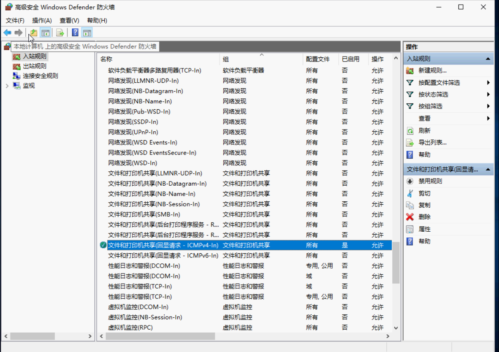
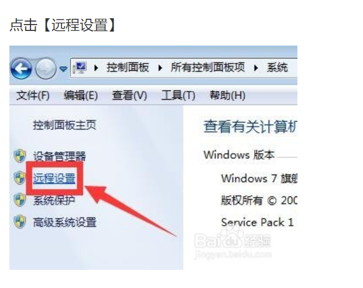

# 概述

## 浅出“数字化校园”(1/5)

温馨提示：若您是一位教育从业者，学习`数字化校园`的意义除了应付行政任务，您很有可能在此之中获取到一些意想不到的工作中省时省力的方法。

简单瞥一眼`wiki`中对`数字化校园`的定义：

```
数字化校园是以数字化信息和网络为基础，在计算机和网络技术上建立起来的对教学、科研、管理、技术服务、生活服务等校园信息的收集、处理、整合、存储、传输和应用，使数字资源得到充分优化利用的一种虚拟教育环境。
```

撇掉专业词汇就是：

```
将校园活动（教学、科研、管理等）产生的信息收集起来进行应用....
```

场景一：招生办公室需要每年通过年级组提供高校录取数据来制喜报


这个过程就体现了——`教学(活动)`产生`学生测评(信息)`，收集后用于`招生推广(应用)`。


## 浅出“数字化校园”(2/5)

巧妇难为无米之炊，没有数据/信息的收集，数字化信息应用就没有根基。

我们通过`2年级`同学小明一天的校园生活为例，来看校园的哪些地方可以产生我们感兴趣的数据/信息：

```
8:08 AM:  小明气喘吁吁跑到学校（因为还有2分钟就迟到了），班长已经开始拿着一个`小本子`记录未到校的同学名字了，他赶紧过去让班长把他的名字划掉。

8:10 AM：小明拉开书包，把各个学科的作业交上来，粗心的小明忘了在数学作业纸上写上姓名；

9:50 AM：课间，数学老师开始到班级里抓`未交作业`以及`未订正作业`的同学，（小明也不幸被批评，因为没写名字），此外数学老师还通过微信将`连续2天未交作业`同学的家长挨个电话问候了一遍，并转告给班主任......

10:00 AM：英文课上，小明和几个顽固分子在课堂里开小会，小明被英文老师提醒了两次。
10:40 AM：英文课下课后，英文老师本打算把小明与同桌上课的情况告诉给班主任，但是刚好班主任不在位置上，事情一多，英文老师就忘了反馈这一信息。

16:28 PM：离学校大门关门还有2分钟，小明赶紧丢下羽毛球跑出校门。
17:00 PM：粗心的小明忘记记录今天的`数学作业`，无奈之下，小明妈妈用微信问数学老师作业。恰好，数学老师今天已经和他的太太出去约会了。
21:30 PM：小明妈妈收到了数学老师发来的作业通知。
21:40 PM：小明开始写数学作业.........

------
日复一日的循环。
```

回顾小明这一天活动产生的信息：

- `到校/离校时间`：通常班主任对此信息感兴趣，这可能反映了小明昨晚的`睡眠`如何，如果小明频繁迟到，那么我们需要向其家长询问他近期`是否有拖延症`；当然`学校后勤`也会对这个信息感兴趣，因为他们需要确认是否已经所有的同学已经离开校园。

- `未交作业/未订正作业/作业未写姓名`学生：`各科任老师`需要及时记录学生的作业情况，对于连续未交作业的学生需要向`学生家长`以及`班主任`同步这部分信息；

- `课堂表现`：这里不仅包括`桌面混乱、课堂违纪、回答消极`的记录😩，还应包括`桌面整洁、听课专注、回答积极`😀的记录（班主任可根据这些`电子信息`在教室后设置了一个红黑榜进行及时的激励/惩戒）。

- `每日作业内容`：虽然科任老师已经在课上或课后让科代表把作业写在黑板上，但是总有一些同学会忘记记录作业，如果`作业内容`若已经固化在教案里，那么完全可以通过`电子版作业`形式按周/月的方式批量布置下去，有变化也可以在微调。

由于教师日常忙碌的工作节奏，通过

- 纸张

- 口头反馈

- excel表格

`收集`、`长期保管`上述日复一日的信息是十分困难的。我们是否有一种在有限的`条件`下就能`简单/高效`的收集这些信息？


实际上这里我们无法得到`到校/离校时间`，班长在班级里统计到的只有`迟到人数`；

## 浅出“数字化校园”(3/5)

`线上课堂`需要怎样的一些装备？

硬件方面，老师们需要类似线下教室的装备：

- 一台使用时间3年以内的电脑
- 绘画版（[wacom CTL672](https://s.taobao.com/search?q=%E6%95%B0%E4%BD%8D%E6%9D%BF&imgfile=&js=1&stats_click=search_radio_all%3A1&initiative_id=staobaoz_20200218&ie=utf8&sort=sale-desc)、[汉王 创艺高手](https://item.taobao.com/item.htm?spm=a230r.1.14.1.579b5cae2b4aJk&id=533181948979&ns=1&abbucket=10#detail)）：（数学/科学课替代鼠标在屏幕上写字）
- 麦克风：如果需要制作标准录播课，建议购买，推荐使用方式像麦克一样的[MicW i436](http://detail.zol.com.cn/404/403516/param.shtml)

软件方面：

- [教室直播软件](http://site.scnu.edu.cn/a/20200209/1200.html?from=timeline)（dingtalk/classin）
  - **直播客户端、超星学习通同步课堂、雨课堂、中国大学MOOC**
  - **优课联盟、优学院、高校邦平台、好大学在线**
  - **腾讯课堂、钉钉、CCtalk、UMU、智慧树-在线大学**
- 作业打卡工具
  - 微信小程序、钉钉


场景二：全校教师在学期期末向班主任提供本学期学科成绩、评语，班主任制作`成绩报告单`后与家长的反馈依据：

各学科老师通常是在学期期末时间加班加点给各个学生汇总成绩（往往是做成一个excel表格），班主任再进一步汇总提交给。

负责`产生信息`的方式往往是负责`学科教师`，`教务`：

在这一传统的活动过程中，收集是手工进行的；手工录入。

 `教师的日常教学活动`：如学生管理（向班主任、家长反馈，严重点上升到校级训辅）、组卷、改卷、办公；

通常能理解上述抽象、且专业的定义的人士往往局限在部分学校的高层以及主管部门的专业人士。而对于广大基层老师、行政人员（包括`IT行政，技术装备科基础岗`）。

为普通`行政事务`服务（如`后勤/教辅/教务`），此部分可通过借鉴/采购第三方`财务`/`物业`管理软件以及`标准规范`；

- `后勤`：提供`教职工`教学/办公所需的`物资`管理流程，制定`必要的`的`审批流程`保障企业成本，配合管理校园资产表（以期管理并减少资产浪费）与`财务`、`董事`定期对齐；

- 设置HR，全面考虑所有员工岗位的工作的`可交接性`（每个人都需要是可替代的）；
- 设置PM角色，对各行政人员的周报、月报进行梳理并与；
- 除了挽留策略，另一方面需要每年/半年召开一次后勤动员会；


- `教辅`：协助`教师`课业以外的教学辅助，如：
  
  - 学生心理辅导
  
  - 家长信息管理（如接待、访谈收集）
  - 学生信息管理（如学生诚信、态度类事件）
  - 培训交流
  
  - 协助`学生`提高学习的辅助系统，如：
    - 云课堂：即以课堂录播重放为中心；
    - 图书馆：拓展世界视野；
  
  - 重点：围绕各类信息收集的电子化收集：包括`图书馆电子借阅系统`、教师通道，`学生管理系统`；
- `教务`：职责/制定`教学计划`，`课程培养方案`，以及`教学方案`；
  
  

新入职`IT行政`：

- 以外的教职工可能对IT系统、软件操作等都不是很内行。
- 即使你提供了文档、操作视频，他们也很可能无法第一时间进行学习培训。
- `任何微乎其微的学习成本`都会对他们产生许多心理压力，需要`IT组`能温柔的对待他们。

一个各行业最佳实践：

在考虑`变革既有系统`时，尽可能的先同时保留`既有系统`（即双系统并行），动员他们中间对`IT系统`比较内行的人先尝试新的变化，大家看到`新IT系统`的好处时，自然就会学习过渡到新系统。


# 后勤

- 机房网络设备


- 办公耗材
  - 打印机自动加墨
  - 桌面插排数不足
  - 办公电脑系统卡顿

- 资产编号

  - 如资产室编号：A203，G203；
  - 如售后联系：

- 财务

  - 颁布《申购&报销》审批办法
- 后勤&安保
  - 启动Q&A表单跟踪事务；
  - 校门口停车问题；
  - `hikivision`设备提供人脸识别
    - 识别签到：包括`校内`在内的任何人，也包括`不良人员`，需要收集校内`人脸数据`。
    - 后期可对热点图，路径图，画像，SKU算法的进行`行为分析`：
      - 如对厕所不冲水的人（进出摄像头视野`>10min`）进行分析；
      - 如对图书馆乱放书的行为分析；


## 教辅

- 教师管理
- 学生管理
- 课程管理
- 活动管理
- 图书馆
- 门户

- 集体备课系统（英语）
  - 《年度教学计划》
  - 《备课教案》

- 活动管理
  - 年度活动计划


# `2019.1学期`重点IT

- 基础设施：

  - 网络布线拓扑

    - 明确`机房管理办法`，在主路由器配置`网络使用策略`；
      - 网络设备
  - 监控 (datasource)

  - 图书馆机房

    - 安排10台`树莓派`与`显示器`供学生查询使用，调整网络后禁止学生携带个人电子设备入校；


- 财务：

  - `报销`：与会计协定 认可的`企业微信审批单`，`手写审批单`不再是必须凭证；
  - 制定了统一的`资产管理清单`，避免重复购买；


- 教务：

  - 训辅：制定`个例分析报告模板`，需要考察的`维度`，周例会的汇报人需要填报`学生事件`；

    - 对于开放的 `open` 状态的`issue`，确保每周有`跟进机制`；
    - 汇报发起人跟踪直至个案`close`，并提交`XX-XXX-个例分析报告`；

  - 活动部：

    - 企业微信制定了`活动审批`进行`活动管理`以及review；

      

  - 逐渐转移`ruianva.cn`招生入口进行；

- 教辅：
  - 图书馆：
    - 创建基于`惟校学号`的自助式`图书借阅程序`，解放行政力量，更多参与到书单选购事宜；
  - portal：`ruianva.cn` portal的招生工作；


## 温州中学

- 机房/机房：
  - 网络监控 sangfor，放在核心交换机前；
- 图书馆/IC卡系统：
  - 浙江正远；
  - [瑞章](http://www.ruizhangtech.com/public/index.php/index/about/introduce?id=1)
- 讯飞改卷
- 校园教务系统：
  - 管理数据库系统表结构；
  - 图书馆系统表结构；
- 教师辅助：
  - 网络备课->改卷系统；


# IT培训

- 为什么使用markdown?

- 智能锁（门禁）

  - 门禁规则：非工作时间大门超过2分钟

- 打铃机

  - `zhongjinaozhongmianfeiban.APK` 终极闹钟免费版，还原

- 桌面云
  - 流媒体服务
  - 协同办公服务

- 课堂辅助


# Infrastructure

服务器选型：选择通用大牌服务器，占3个u的刀片服务器，虽然同样的配置往往要贵10%，但是这是有必要的，其硬件稳定性以及维护软件（`iDRAC网口，需查看初始密码`）对于后续运维都是十分重要的。如：DELL R730 /R7425；

另外机柜一定记得买1米深的长度；

|              | 30用户                             | 50用户                             |
| ------------ | ---------------------------------- | ---------------------------------- |
| cpu          | E5-2620V4 2.1Ghz x 2               | E5-2630V4 2.2Ghz x 2               |
| ram          | 128GB(16GB DDR4 * 8)               | 224GB(32GB DDR4 * 7)               |
| data storage | 4TB * 4 (7.2K)                     | 4TB * 2(7.2K)                      |
| os storage   | 240G SSD * 2 [Intel S4500/S3520]   | 240G SSD * 2 [Intel S4500/S3520]   |
|              | SSD：480GB * 2 [Intel S3510/S3520] | SSD：480GB * 2 [Intel S3510/S3520] |
| 网口         | GE*4                               | GE*4                               |
| 电源         | 双电源                             | 双电源                             |

`R730XD 2620V42 /16GB/4T SAS4+240G SSD2+480G SSD2/H730P/750Wx2/导轨  38500`

`RS720A-E9 RS24   7351P*2  224G   4t*4 240G*2   480G*2   双电   45900`

### CPU

配好一点的，因为这个东西贵，且只能以`替换式升级`；

[AMD 霄龙 7351p](http://detail.zol.com.cn/servercpu/index1174576.shtml)

### [内存](https://www.idcbest.com/servernews/11002265.html)

以128GB起步，根据使用场景进行拓展，通常内存价格，2850元/32GB

- 配置:

  - cpu: epyc 7351*2  
  - ram: 128g  

  - 存储：
    - 数据盘：sata hdd: 4t*4   ssd: 480g*2  
    - OS盘：BOSS 控制器卡 + 含 2 M.2 Sticks 240G (RAID 1)

  - 网卡：四口ge，电口
  - raid卡：支持并行raid5，如h730p

### 存储

2个480G SSD与4个4TB SATA构成分层存储，采用Mirror模式，提供大约8TB的有效存储空间。分层存储是利用Windows Server 2012R2的Storage Space特性实现的。该特性可以混合使用SSD和HDD，提供分层存储的能力。热点数据保存在SSD(OS使用)。从而实现HDD的容量，和接近SSD的IO性能。

功能1： 教学服务：

- 桌面云，后期信息技术课统一管理学生终端，可创建30-50台WIN7虚拟机，学生通过树莓派连接到桌面云; 

功能2：行政/教学服务：

- 教师流媒体服务器，采购后下学期，搭建课堂录播流媒体服务；

- 教师协同办公服务，目前使用的免费网络共享有较大限制，服务器采购后使用Only office服务；

- 教师文件管理服务，目前使用的公用电脑存储较少，服务器采购后使用Nextcloud 文件管理服务。

- 服务器cpu、内存、磁盘价格基本平稳（其中服务器内存价格3年稳定）；

- 中美贸易战背景下，cpu有较大涨幅可能，下学期有较大可能开`信息技术`课程；


# 报销


## BIOS

开机F2进入

### iDRAC SETTINGS

查看好ip，确认idrac网线接通后，使用主机正面`开机键下方`标签提供的`root`初始化密码登陆：

`XHAEVF4PF3EP`

在此界面中进入最后一项锁定设置`disabled`，然后进行密码重置；


## 机房解决方案

- VDI（Virtual Desktop Infrastructure）：虚拟桌面设施；

  `锐捷RCD6000-Main`可以支持50个VDI终端+3200个IDV终端；

客户端可考虑[HP mt44](https://www8.hp.com/us/en/thin-clients/mobile/mt44.html?jumpid=in_r11260_us/en/psg/hp_thin_clients/os-windows-embedded-mt44)，[lenovo ideapad d330](http://detail.zol.com.cn/notebook/index1231701.shtml)

移动机柜方面：[玺瑞中泰笔记本充电柜](https://item.taobao.com/item.htm?spm=a1z10.5-c-s.w4002-19007023971.21.5ed425c8pnBTeC&id=581393212553) 支持`机柜背后有插座，统一可放适配器的位置`*30；

- TYPEC充电[笔记本](https://baijiahao.baidu.com/s?id=1619720632244494136&wfr=spider&for=pc)

三星笔记本9

Spectre x2

Apple MacBook Pro


## Windows Server 2019

分为两个版本`standard`与`datacenter`，如何做一个免费版的桌面云：

- 可用作虚拟化访客
- 否。2 虚拟机，以及每个许可证一个 Hyper-V 主机
- 否。无限制的虚拟机，以及每个许可证一个 Hyper-V 主机

Microsoft Hyper-V Server 2019 

它为在相同硬件上运行的虚拟机提供了无限基于虚拟机许可证。它还包括新功能，如储存空间直通和存储副本，以及新的受防护的虚拟机和软件定义的数据中心场景所需的功能。


`windows 10 Home`版也使用[rdp](https://blog.csdn.net/BaoBeiDeXiaoDaiGua/article/details/79314700)；

https://raspberrypi.stackexchange.com/questions/32540/a-great-rdp-client

http://www.xitongcheng.com/jiaocheng/dnrj_article_47179.html

```
Dism /online /Get-TargetEditions
Dism /online /Set-Edition: /ProductKey:RC4VN-4GQBW-WYPTV-3BD66-FVXR6 /AcceptEula
```


## KVM+Spice

[Spice](https://gitlab.freedesktop.org/spice/spice)更新再次启动

基于开源协议优化的桌面虚拟化厂家，如`深信服、锐捷、青葡萄`等。这些厂家的特点是使用开源的KVM虚拟化系统和SPICE协议，对虚拟化系统和SPICE协议做了一些增强。通常提供从硬件基础设施、桌面虚拟化软件、云终端的整套解决方案。


专注于桌面虚拟化管理的桌面虚拟化厂家，如`杰云科技、晨云、武汉噢易`等。这些厂家的特点是支持多种桌面虚拟化系统和桌面协议，可以选用商用的虚拟化平台。  


http://www.jieyung.com/articles/shownews.php?lang=cn&id=73

http://bbs.51cto.com/thread-1547675-1.html

USB重定向


## mstsc(rdp) vs vnc


| Software                                  | Protocol          | License     |
| ----------------------------------------- | ----------------- | ----------- |
| Citrix XenApp                             | RDP, ICA          | Proprietary |
| FreeNX                                    | NX, RDP, RFB(VNC) | GPL         |
| LogMeIn                                   | Proprietary       | Proprietary |
| Neatx                                     | NX                | GPL         |
| rdesktop                                  | RDP               | GPL         |
| RealVNC                                   | RFB(VNC)          | GPL         |
| UltraVNC                                  | RFB(VNC)          | GPL         |
| Remote Desktop Services/Terminal Services | RDP               | Proprietary |
| SSH with X forwarding                     | X11               | BSD         |
| Symantec pcAnywhere                       | Proprietary       | Proprietary |
| Citrix XenAppRDP                          | ICA               | Proprietary |

[发展路径](https://www.cnblogs.com/coderzh/archive/2010/09/24/thinclient-protocol.html)


- 软件：
  - os：Windows Server 2012R2 DataCenter (支持无限台虚拟机Hyper-V) 正版授权价格1000美元左右；
    - [Deskpool 3.1 For Hyper-V 试用版](https://vdi-1251215814.cos.ap-guangzhou.myqcloud.com/deskpool/Deskpool_Hyper-V_2012R2_V3_1_0.msi) 0元；
- 总计：6万左右

- 客户端方案1：
  - 主机：树莓派3b+：300元； 
  - 键鼠套装：罗技 MK200 80元；

    

- 客户端方案2：

  - 轻薄型笔记本：2500元

    

- 电脑

|        | 方案1                                                        | 方案2               |
| ------ | ------------------------------------------------------------ | ------------------- |
| 主机   | 树莓派3b+                                                    | 轻薄型笔记本 2500元 |
| 外设   | 罗技 MK200 80元                                              |                     |
| 显示器 | [AOC I2080SW](http://detail.zol.com.cn/lcd/index402966.shtml) 500元 |                     |
| 优点   | 显示器较大，价格实惠，硬件维护成本低                         | 便于运输            |
| 弱点   | 不利于运输                                                   | 硬件、维护成本较高  |

- 客户端软件：

  - os：android 7.0/ centOS 6.6 (免费)
  - 云桌面客户端：云杰瘦客户端os (JYOS)  (免费)

树莓派3b+配置

```
博通BCM2837B0 SoC，集成四核ARM Cortex-A53（ARMv8）64位@ 1.4GHz CPU，集成博通 Videocore-IV GPU
内存：1GB LPDDR2 SDRAM
有线网络：千兆以太网（通过USB2.0通道，最大吞吐量 300Mbps）
无线网络:2.4GHz和5GHz 双频Wi-Fi，支持802.11b/g/n/ac
蓝牙：蓝牙4.2&低功耗蓝牙（BLE）
存储：Micro-SD
其他接口：HDMI，3.5mm模拟音频视频插孔，4x USB 2.0，以太网，摄像机串行接口（CSI），显示器串行接口（DSI），MicroSD卡座，40pin扩展双排插针
尺寸：82mmx 56mmx 19.5mm，50克

--300元
```

- [J35N](https://item.taobao.com/item.htm?spm=a1z10.5-c.w4002-5489146991.6.4b732dccD9MuQ4&id=569798740397)

```
--360元且带软件 瘦客户机（云终端）软件系统
另外还提供免费版license
http://www.jieyung.com/product/showproduct.php?id=79
ARMV8 2.0GHz
DDR3 1866:512MB
闪存：4GB
```


## 测试环境安装

[官方文档](http://www.jieyung.com/service/show.php?id=169)：1493895271.pdf


# 批量运维管理：DISM++

多session

Start->Administrator tools->Remote Desktop Services->Remote Desktop Session Host Configuration

取消：Restrict each user to a single session

43QM8-N693D-TFDY7-9QXHM-X4VY4

# Platform

## [OS: hyper-v server](https://www.microsoft.com/en-us/evalcenter/evaluate-hyper-v-server-2019)

安装了license verse

管理->添加->远程桌面服务，HOST/授权/虚拟化主机

### 安装

- 对于付费解决方案，通常使用测试稳定运行超1年的os：如`windows server 2016 datacenter/vmware sphere/华为FusionAccess`；
- 实际上对于看这篇文章的你而言，一定是在考虑使用`低成本/免费`方案，也就是这篇文章的主角：
  - `Microsoft Hyper-V` is a stand-alone product that contains only the `Windows hypervisor`, a `Windows Server driver model`, and `virtualization components`. 
  - [HYPER-V 避坑指南](https://post.smzdm.com/p/574836/) 
  - [2016](http://www.imsdn.cn/operating-systems/windows-server-2016/)


### 安装/配置Hyper-V

控制面板里添加；

### [datacenter激活](https://www.virtualizationhowto.com/2019/02/upgrade-windows-server-evaluation-to-full-version-standard-to-datacenter/)


dism /online /get-currentedition

/productkey:`RC4VN-4GQBW-WYPTV-3BD66-FVXR6`

### mstsc

powershell远程连接


```powershell
#服务端
Enable-PsRemoting
#客户端
Set-Item wsman:\localhost\Client\TrustedHosts -value *
Enter-PSSession 192.168.0.149 -Credential administrator


Set-ItemProperty -Path 'HKLM:\System\CurrentControlSet\Control\Terminal Server' -name "fDenyTSConnections" -value 0
Enable-NetFirewallRule -DisplayGroup "Remote Desktop"

slmgr.vbs -upk #执行原有安装密钥的清除(若系统为未激活状态可以省略)
slmgr /ipk XXXXX-XXXXX-XXXXX-XXXXX-XXXXX #安装对应版本的GVLK密钥
slmgr /skms kms.domain.com #KMS服务器的域名或者内部IP
slmgr /ato #执行KMS激活操作

#若提示 错误:0xC0000022 在运行 Microsoft Windows 非核心版本的计算机上,运行”slui.exe 0x2a 0xC0000022″以显示错误文本
#（在HKEY_LOCAL_MACHINE–》SOFTWARE–》Microsoft–》Windows NT–》CurrentVersion–》SoftwareProtectionPlatform里面，将SkipRearm的值修改为1）重启电脑
#以管理员身份启动cmd，输入SLMGR -REARM，根据提示，再次重启电脑

slmgr /upk
slmgr /ipk WMDGN-G9PQG-XVVXX-R3X43-63DFG
slmgr /skms zh.us.to
slmgr /ato
```

#### 管理->高级安全防火墙->启用一下端口/服务



#### 控制面板->系统->远程设置

## 虚拟机初始化

### 创建bridge网卡

### 设置远程`服务`/`设置`启用



### 控制面板 cleartype

### rdp

http://blog.chinaunix.net/uid-29479952-id-5761566.html


### rdp音质

raspberry xfreeRDP latency

```

rdpdr – 设备重定向

cliprdr – 剪贴板重定向

drdynvc – 动态重定向

audin – 音频输入重定向

rdpsnd – 音频输出重定向

tsmf - 视频重定向

 

一、设备重定向

    1.磁盘重定向

    --plugin rdpdr --data disk:: --

Name:被重定向后磁盘的名称；

    Path:将要被重定向的本地目录；

2.智能卡重定向

--plugin rdpdr --data smartcard: --

Name:被重定向后智能卡的名称；

3.串行端口重定向

--plugin rdpdr --data serial:: --

重定向串行端口（eg.COMx）到服务端

4.并行端口重定向

--plugin rdpdr --data parallel:: --

重定向并行端口（eg.LPTx）到服务端

5.打印机重定向

--plugin rdpdr --data printer:: --

重定向一个或多个打印机到服务端

二、剪贴板重定向

--plugin cliprdr同步client和server端的剪贴板；

三、音频输入重定向

--plugin drdynvc --data audin –

启用音频输入重定向（例如麦克风）

四、音频输出重定向

    --plugin rdpsnd --data alsa --   使用ALSA system

--plugin rdpsnd --data pulse --   使用PulseAudio

--plugin rdpsnd --data latency:50 --   使用rdpsnd with a given latency in ms

--plugin rdpsnd   默认

五、多媒体重定向

服务端要求，这要求我们的server端必须是windows server 2008 R2或者是windows 7。当服务端为windows server 2008 R2时需要手动启动音视频重放重定向功能。Windows7系统无需任何设置即可用于多媒体重定向的server端。

客户端要求，必须安装以下组件：

FFmpeg (libavcodec-dev)

ALSA (libasound2-dev) and/or PulseAudio (libpulse-dev)

XVideo (libxv-dev)

1.快速启动多媒体重定向

Freerdp会选择默认的音频设备

xfreerdp --plugin drdynvc --data tsmf --

2.音频输入

xfreerdp --plugin drdynvc --data tsmf:audio:pulse --

xfreerdp --plugin drdynvc --data tsmf:audio:alsa:plughw:0,0 –

3.视频适配器

当你不想使用默认的视频适配器或者默认的视频适配器被占用时，你可以选择指定的视频适配器

xfreerdp --xv-port (port) --plugin drdynvc --data tsmf -- (server)

cat /proc/asound/card0/pcm0p/sub0/hw_params

vi /etc/pulse/daemon.conf

```

https://bbs.archlinux.org/viewtopic.php?id=185736


### 软件初始化

## 客户端

- 镜像下载 `WIN7x86img.zip`；
- [批量创建虚拟机](http://blog.51cto.com/biwei/2308671)

老毛桃要以`iso`模式走起，启动时按F12进入；

- 密码千万别忘记，设置一个密码u盘


## 批量制作脚本

```powershell
xcopy手工处理
echo d | xcopy 1001\Virtual Hard Disks\vdisk 1002


第一步：制作模板VHDX文件（略）；
第二步：制作初始化系统脚本（自动设置IP、GW等）；


将以下2个脚本放置到模板VHDX中的C:\Windows\Setup\Scripts目录下：
第1个脚本：FirstRun.ps1
#获取计算机名称
$VMname=hostname

#根据计算机名称获取IP地址后6位
[int]$IP1=$VMname.Substring($VMname.Length - 6,3)
[int]$IP2=$VMname.Substring($VMname.Length - 3,3)

#设定FSNNetwork
$IPaddr1=$IPaddr1='172.1.' + $IP1 + '.' + $IP2
New-NetIPAddress -InterfaceIndex 12 -IPAddress $IPaddr1 -PrefixLength 16 -DefaultGateway 172.1.0.250
Set-DnsClientServerAddress -InterfaceIndex 12 -ServerAddresses ("172.1.0.1","172.1.0.2")
exit

第2个脚本：SetupComplete.cmd (该脚本名称必须为SetupComplete)
Powershell -Command "C:\Windows\Setup\Scripts\'FirstRun.ps1'"
timeout 3
gpupdate /force
cd  C:\Windows\System32
wuauclt.exe /DetectNow /UpdateNow
::cd  C:\FalconAgent
::falcon-agent.exe -service install
::sc.exe config  falconagent Start=delayed-auto
::falcon-agent.exe -service start
del C:\Windows\Setup\Scripts\FirstRun.ps1
del %0


第三步：创建自动化部署脚本
# ================================ #
#    Create-VM_V1.0(Windows).PS1   #   
#   通过PowerShell创建Hyper-V虚机  #  
# ================================ #
#Param($VM_Name,$VM_HostName)

Write-Host -NoNewline -ForegroundColor Magenta '请输入要创建的虚机名称（如：VWSR******）'
[String]$VM_Name = Read-Host
Write-Host -NoNewline -ForegroundColor Magenta '请输入需要放在哪台宿主机上（如：PWSR******）'
[String]$VM_HostName= Read-Host
Write-Host -NoNewline -ForegroundColor Magenta '要部署App Server还是SQL Server？默认App Server回车即可（如:sql 回车或者2 回车）'
[String]$VM_OSClass= Read-Host

#判断虚机名称是否为大写字母
if ($VM_Name |findstr 'vwsr')
   { Write-Host -NoNewline -ForegroundColor Yellow '注意：虚机名需要使用大写字母！！！'
     break } 
Else
   { }
   
$VM_Memory= 4GB
$VM_CpuCount= 4
$Owner= "IT"
$Org= "sxleilong.com"
$NetworkSwitch= "FSNNetwork"
#$AdminPassword = "Administrator Password"
$SourcePath= "D:\VM_Deploy_Script"
$DjoinSource= $SourcePath + '\' + $VM_Name +'.txt'

#if判断要部署App Server还是SQL Server，默认是App Server
if (($VM_OSClass -eq '2') -or ($VM_OSClass -eq 'sql') -or ($VM_OSClass -eq 'SQL'))
   {$Template_VHDX= $SourcePath + '\' + 'En_WinSrv12R2_For_SQL.vhdx'
    Write-Host -ForegroundColor Green "您选择安装SQL虚机!！！"
    }
Else
   {$Template_VHDX= $SourcePath + '\' + 'En_WinSrv12R2_For_APP.vhdx'
    Write-Host -ForegroundColor Green "您选择安装App虚机!！！"
    }

#if判断如果虚机所在宿主机为管理系，虚机文件存放位置为E盘  
if (( $VM_HostName -eq 'PWSR252001' ) -or ($VM_HostName -eq 'PWSR252002' ))
   { $VM_Path = 'E:\' + $VM_HostName + '_E_VMs'
     $VM_RemotePath = '\\' + $VM_HostName + '\E$\' + $VM_HostName + '_E_VMs' }
Else
   { $VM_Path = 'D:\' + $VM_HostName + '_D_VMs'
     $VM_RemotePath = '\\' + $VM_HostName + '\D$\' + $VM_HostName + '_D_VMs' }	 
$VM_VHDPath = $VM_Path + '\' + $VM_Name + '\Virtual Hard Disks\'+ $VM_Name + '.vhdx'
$VM_VHDRemotePath = $VM_RemotePath + '\' + $VM_Name + '\Virtual Hard Disks\' + $VM_Name + '.vhdx'

#if判断是否为0系管理服务器，用以自动加入不同OU
if ($VM_Name |findstr 'VWSR000'	)
   { $VM_MachineOU= "OU=MgmtServers,OU=sxleilong,DC=sxleilong,DC=cn" }
Else
   { $VM_MachineOU= "OU=NewInfra,OU=Production Servers,OU=sxleilong,DC=sxleilong,DC=cn" }

#编辑应答文件模板
$UnattendTemplate= "Unattend-template.xml"
$Unattendfile= New-Object XML
$Unattendfile.Load($SourcePath+"\"+$UnattendTemplate)
$Unattendfile.unattend.settings.component[2].ComputerName=$VM_Name
$Unattendfile.unattend.settings.component[2].RegisteredOrganization=$Org
$Unattendfile.unattend.settings.component[2].RegisteredOwner=$Owner
$Unattendfile.unattend.settings.Component[3].RegisteredOrganization=$Org
$Unattendfile.unattend.settings.Component[3].RegisteredOwner=$Owner
#$UnattendFile.unattend.settings.component[3].UserAccounts.AdministratorPassword.Value=$AdminPassword
#$UnattendFile.unattend.settings.component[3].autologon.password.value=$AdminPassword
$UnattendXML=$SourcePath+"\"+$VM_Name+".xml"
$Unattendfile.save($UnattendXML)

#Mount模板VHDX
Mount-diskp_w_picpath $Template_VHDX
$DriveLetter=((Get-DiskImage $Template_VHDX | get-disk | get-partition | Where-Object Type -eq "Basic").DriveLetter)+":"

#注入Unattend.xml文件到VHDX中
$UnattendXml_Destination=$Driveletter+"\Windows\System32\Sysprep\unattend.xml"
Copy-Item $UnattendXml $UnattendXml_Destination -Force

#生成Offline JoinDomain文件
Djoin /Provision /Domain sxleilong.com /Machine $VM_Name /MachineOU $VM_MachineOU /Savefile $DjoinSource /Reuse

#注入Offline JoinDomain文件，并移除历史DjoinFile
$DjoinDestination= $Driveletter+'\Windows'
$His_DjoinFile= $DjoinDestination +'\'+'VWSR*.txt'
Remove-Item -Path $His_DjoinFile -Force
Copy-Item $DjoinSource  $DjoinDestination -Force
Djoin /RequestODJ /Loadfile  "$VM_Name.txt" /WindowsPath $DjoinDestination /LocalOS

#注入开机运行脚本
$ScriptFolder=$DriveLetter+"\Windows\Setup\Scripts\"
$Scriptname=$Scriptfolder+"FirstRun.ps1"
If (Test-Path $ScriptFolder)
   {}
Else
   {
    New-Item $ScriptFolder -ItemType Directory
    Copy-Item "$SourcePath\Scripts\*" $ScriptFolder -Force
   }

#DisMount模板VHDX
dismount-diskp_w_picpath $Template_VHDX

#Remove应答文件和Djoin文件
Remove-Item -Path $DjoinSource
Remove-Item -Path $UnattendXml

#Copy虚拟机VHDX文件
New-item -path $VM_RemotePath\$VM_Name -name "Virtual Hard Disks" -ItemType directory
Copy-Item -Path $Template_VHDX -Destination $VM_VHDRemotePath

#新建虚机
New-VM –Name $VM_Name -ComputerName $VM_HostName –Generation 2 -MemoryStartupBytes $VM_Memory -SwitchName $NetworkSwitch –Path $VM_Path -VHDPath $VM_VHDPath

#设置CPU个数
Set-VM -Name $VM_Name -ComputerName $VM_HostName -ProcessorCount $VM_CpuCount

#禁用动态内存功能
#Set-VMMemory -Name $VM_Name -ComputerName $VM_HostName -DynamicMemoryEnabled $False  

#添加DVDDrive
Get-VM -Name $VM_Name -ComputerName $VM_HostName |Add-VMDvdDrive -ControllerNumber 0

#设置VLANID
#Set-VMNetworkAdapterVlan -ComputerName $VM_HostName -VMName $VM_Name -Access -VlanId 1112

#通过SCVMM分配静态MACAddress
#Import-Module virtualmachinemanager
Read-SCVMHost -VMHost $VM_HostName |Out-Null
$VM=Get-SCVirtualMachine -Name $VM_Name
$Adapter=$VM.VirtualNetworkAdapters[0]
Set-SCVirtualNetworkAdapter -VirtualNetworkAdapter $Adapter[0] -MACAddressType "Static" -MACAddress "00-00-00-00-00-00" |Out-Null

#启动虚机
#Start-VM -Name $VM_Name -ComputerName $VM_HostName
Start-SCVirtualMachine -VM $VM_Name
```

## Deskpool for Hyper-V 

- [下载](http://www.jieyung.com/software/showdownload.php?id=62)

## Docker for onlyOffice

os推荐使用[centos](http://isoredirect.centos.org/centos/7/isos/x86_64/CentOS-7-x86_64-DVD-1810.iso)


#配置github 加速gfw sslocal

vi ~/.gitconfig
[http]
        proxy = socks5://127.0.0.1:1080
[https]
        proxy = socks5://127.0.0.1:1080

#执行安装
https://github.com/ONLYOFFICE/docker-onlyoffice-nextcloud


# 学生档案

首先，依赖于`校园内部编号`，常用于如下领域：

- 入学注册

- 学生看版
  
  - 成绩登记
  - 期末手册
  - 每周日报、月报
  
  

使用标准IC卡`85.6×53.98 mm`制作实体卡；

- 具体设计规格如下:
  - `二维码粘 40mm*20mm`
  - `防水挂脖卡牌`

    - `规格2: 71mm * 99mm `

      


学号编号规则：

- `180101`：`唯一编号`，为方便记忆，暂以`一年级对应入学年`+`班级号`+`班级序号`，换班、留级、跳级惟一号都不进行修改；

- [具体学号清单如下](https://shimo.im/sheet/lbJ0v4vtxg8z0G88/veCwB)：


## 校园卡

制作标准IC卡

- 1.是否买制卡设备，利：信息安全性好，后期补卡方便；弊：需专门维护一个打印设备，管理耗材；

- 2.批量对学生拍摄，关联二维码；

  - `找一个靠谱的打印店，形成长期密切的合同，可以贵一点，但是品质不能差。`
  - 金龙广告： 133 5338 5533

制作一个二维码贴

- 贴在姓名

叶文博

蔡铭泽

## 相关程序/脚本

- 编号生成

```perl
perl -e 'for ( 1..1000 ) {$num=(sprintf "%07d", $_);print "$num\n";}' #图书馆
perl -e 'for my $year(12..20) for my $class(1..3) {for ( 1..36 ) {$num=(sprintf "%02d", $year).(sprintf "%02d", $class).(sprintf "%02d", $_);print "$num\n";}}' #学号
```

- `OfficeAutoService.groovy`报告单程序

  


## 明细维度

- 维度：

  - 自然属性
  
    - 视力表
    - 近2学期体育成绩及评语
    - 病假次数
    - 家庭属性
      - 父亲姓名、父亲职业
      - 母亲姓名、母亲职业
      - 是否有亲人
        - 相关学号
      - 家访时间表；(X)
  
  - 能力类

    - 班级总成绩排名
    - 获奖履历
  
  - 态度类
    
    - 课堂表现
  - 礼仪之星
    - 志愿者之星
    - 是否签署过三方协议
    
    - 诚信事件
      - 抄袭事件
      - 撒谎事件
    
    
  

# 测试卷归档

```
 gswin64c -dNOPAUSE -dBATCH -sDEVICE=jpeg -r300 -sOutputFile=D:\\1.doc\\va\\1.math\\3.单元测试\\单元测试\\T06\\T06_%02d.jpg .\T06.pdf
```
   "-dQUIET",    安静的意思，指代执行过程中尽可能少的输出日志等信息。（也可以简写为“-q”）
    "-dNOSAFER",    通过命令行运行
    "-dBATCH",    执行到最后一页后退出
    "-dNOPAUSE",    每一页转换之间没有停顿
    "-dNOPROMPT",    没有相关提示                       
    "-dFirstPage=1",    从第几页开始
    "-dLastPage=5",     到第几页结束  
    "-sDEVICE=pngalpha",    转换输出的文件类型装置，默认值为x11alpha
    "-g720x1280",    图片像素(-g<width>x<height>)，一般不指定，使用默认输出
    "-r300",    图片分辨率（即图片解析度为300dpi），默认值好像是72(未测试证实)
    "-sOutputFile=/opt/shanhy/error1png/%d.png",    图片输出路径，使用%d或%ld输出页数


# BI报表

对于1级考察项：`ID / DIM_NAME / DIM_VALUE`；

对于2级考察项：

目前我们的科目成绩(学科/技能/作业/品格与习惯) 结构如下： 科目成绩-> 1级评价项 -> 2级评价项。（其中2级评价项目，仅小学涉及，为各个老师对1级评价项的明细打分）

[rollup](https://blog.csdn.net/u012388497/article/details/45577673)

[树形下钻](http://lxw1234.com/archives/2015/04/193.htm)

[FINEREPORT](https://www.zhihu.com/question/41526815)

```sql
select sum(value*weight) / sum(case when value is not null then weight else 0 end)
```

- 180101 Joshua 技能 
  - 想象力
    - 语文
    - 数学
    - xx
    - xx
  - 思考
    - XX
    - XX


STUNO SEMESTER SUBJECT DIM1 WEIGHT DIM2

18101 18-1

## word2pdf

[DOCX 2 PDF](https://www.cnblogs.com/Mr-nie/p/8029085.html)


# 会议/汇报跟踪

在网络共享上企业内部全员`可读/写`、`安全`、`免费的`会议一栏，并通过`跟踪闭环表`确保事后回顾(after action review)；

会前：

- owner记录会议/报告的`主题`、`纪要`（网络共享）
- 微信群通知时间（15min~1.5h为宜)通知与会人员会议id，；


会后：

- `问题提出人`记录闭环跟踪表；
- `问题跟踪/评价人`判断问题`是否需要执行`，以及`原因`；
  - 若问题需要执行，则问题`优先级`、计划完成时间；
  - 若问题不需要执行，则后续流程`终止`；
- `问题负责人`再解决问题后，记录`实际完成时间`以及`问题解决情况`、以及`输出物`；
- `问题跟踪/评价人`判断问题`问题状态`、以及`评价`，`下一步工作`


会中：

- 期望发生

- 实际发生

- 差异分析
- 下一步怎么做


- 会议类型：
- 时间：
- 地点：
- 通知人员：
  - 缺席人员：

- 主题(subject)：
- 纪要(agenda)：
  - topic1：
  - topic2：
- 标记事宜：
  - 跟踪：
    - owner
  - todo：
    - owner


小1如何不做`保姆`：-> 培养`领导力`，进门4件事、课间、放学抄作业

`学习资料单`、`学期教案`；

约谈，怎么在教的/应该

**黑脸预警**；**舆情分析**

家长配合工作了吗？家长安排反馈了吗？

月报反馈学生健康度，运维危险度，避免“晴天霹雳”；

如果家长没反馈，达不到效果，则应该明确责任；


# 云桌面增加

- 在数据库表v2中预分配`IP`，建议是和vano一致，创建虚拟机记录`静态`MAC，设置到路由器，最后再提交到数据库中；

- 

```
  CREATE view va2v as 
  SELECT VANO||CNNAME,substr("云桌面命令", 25, 13) as c1,'00-15-5D-E4-20-'||MAC as v2 FROM "va2" where "云桌面命令" like '%192%' 
  AND LENGTH(MAC)>0 
  order by 1;
  select * from va2v;

```


  ```

  ```