# 常用信息

- 电信客户经理：133 8587 4559
- 电信故障：10000
- TPLINK技术售后：400-886-3400 -> 2企业

- 瑞安本地安防服务商：
  - 蔡丰电脑
  - 宏都小区25幢东起3号
  - 联系号码：136 4656 4301 

## 宽带口令

100M：

- `YZtr`
- 2r4mpixp
- http://192.168.1.1:8080/ useradmin/dxyyp

500M：`sDGv`：

http://192.168.1.1:8080/


# 机房规范

- 第三方设备（如光猫、解调器、入户）与校方设备的禁止放在同一机柜，便于后续机房迁移时不需拆挪设备；

- 所有校方设备采购需提供`管理员`，`规划机柜位置`，`设备说明`；
- 线材长度：入机房的长度以入柜长度为宜，并保留10m备长线；过长占用过多空间，过短则会无法入柜；

- 远程管理规范
  - 入户光纤、以及机房网络，需接入统一远程管理PC；
  - 管理PC可访问子网下所有路由器（宽带）、交换机、打印机；

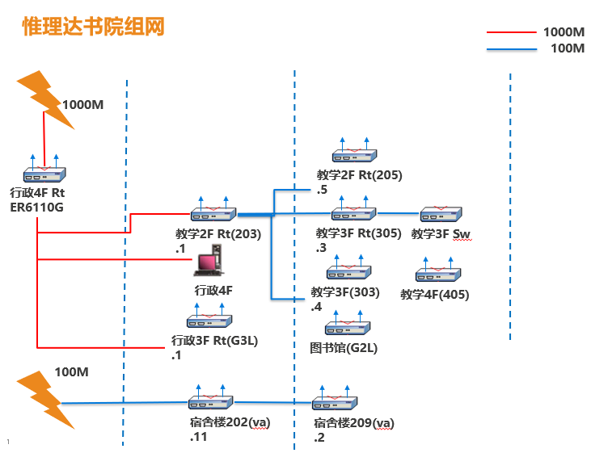


- TP-LINK推荐组网方案：

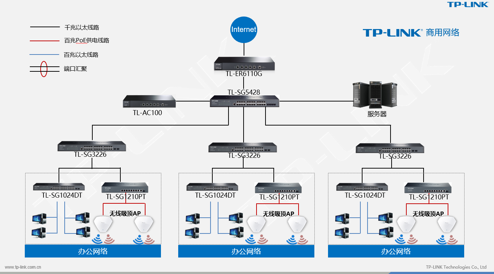


## 路由器

- 你真的明白路由器的作用吗？如果你知识需要WIFI，用路由器来做放大器实在是大材小用，应该是用AP！
- WAN口与LAN口区别：
  - Wide Area Network 广域网，一个接口一个网段
  - Local Area Network 本地网，一组在一个网段
- 路由器串接：
  - 以203为例，它的3个LAN出口其实刚好是3个205、305、303的WAN口，所以203必须是.1网段；
  - 3个路由器；
- 通常默认WAN口是192.168.1网段，LAN口设置静态网段需避开此网段，否则需要重置；
- 如果只用路由器的LAN其实就是交换机；

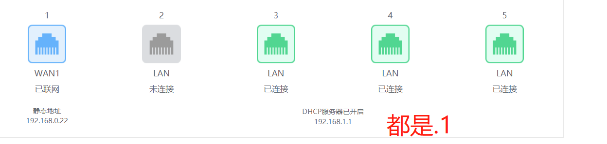

- [双频路由器](https://baijiahao.baidu.com/s?id=1608239954008774952&wfr=spider&for=pc)

- WDS无线桥接是对于两个WIFI之间无线材连接的方法，对于已经连线的路由器无需使用。


## todo

- 测试203的WAN口IP改成静态192.168.2.xx(以确认是否必须是0.xx；

  - 预计是可以的，因为VLAN接出来的接口是1-2，并非是第一个，因此可能无固定关联；

- 购买备用路由器测试用；

  - 企业路由器：https://item.jd.com/5531915.html#crumb-wrap

- 布线整理完毕后
  - `交换机`3号口接线(`2-3`)无信号（不知道以前是否有），`插上电源`后显示有信号；
  - 原`路由器`2号口接线(`1-2`)太短接不上，接在交换机1(2-1）上，有信号源；


- VLAN路由器 CONSOLE口无法联通；
- `交换机`管理员密码以及重置方法；

  - 电脑直接连交换机无法使用网络；

  
- 入网有一个分线盒，可否取代？  

- 入户线无标志，无法了解究竟哪根线对应哪个区域；

- 许多入户线长度只有1m，太短无法`正常`入柜；

  - 需请人重新拉线；

  

  


产品型号：

​	TL-WVR900L、TL-WAR1200L、 TL-WVR450G

​	

# 网络管理方案

在目前就办公网络有限的情况下，仅允许绑定mac连接`业务网络 5MB/s`，访客只允许访问总带宽固定的`访客低速网络1MB/s`；
- 路由器设置定时重启/清空路由表。

- 网络管控

  - `业务网(203/205/303/305)`：目前每个老师教师绑定一台设备MAC，网络限定速度为5M/设备；

    - [mac获取方法](https://jingyan.baidu.com/article/b0b63dbf3fefd14a48307013.html)

      - 启动终端：

        - windws：点击`WIN键+R` -> `cmd` 

        

        - mac：launchpad -> terminal

          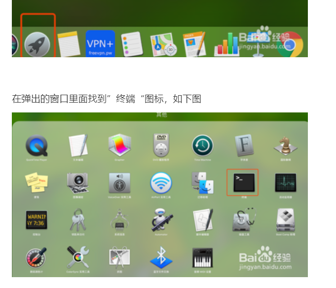

     - 输入网卡检查命令，将结果中`无线局域网`对应的物理地址粘贴到[石墨](https://shimo.im/sheet/k32Q7H0eLQ0Te92J/R3DFr)
      ```bat
    # WINDOWS下输入
    ipconfig /all 
    # MAC下输入
    ifconfig /a
      ```
     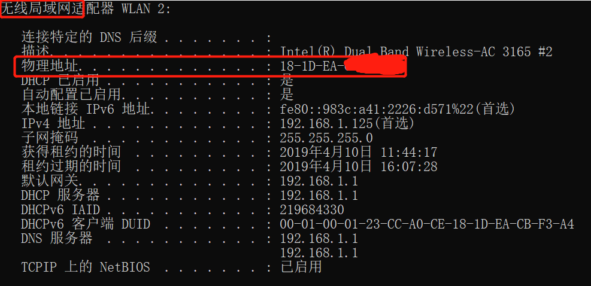


  - `访客网(ruianVAx)`：网络限定速度为1M/设备，密码定期目前暂定为`ruianVA123`；

      - 为便于课堂纪律以及校园网络管理，网络接入将限制学生`个人的电子设备`接入任何网络；

          - 原则上，应配合通知家长禁止携带个人手机/电脑；
          - 对于社会课上对检索的需求：图书馆将采购一批`树莓派`作为上网检索工具，可转移到图书馆进行；需@奇美 胡校理一下图书馆。


# 路由器情况

## 203

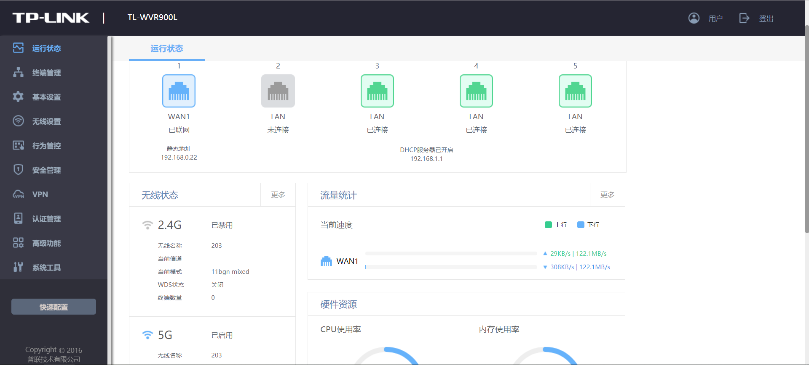

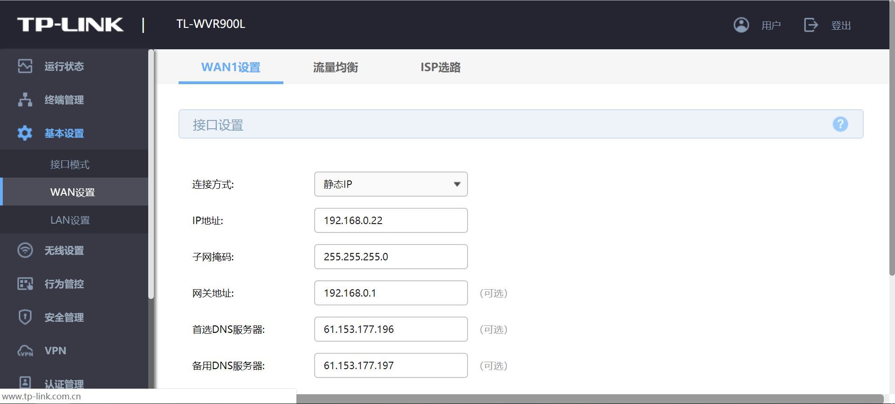

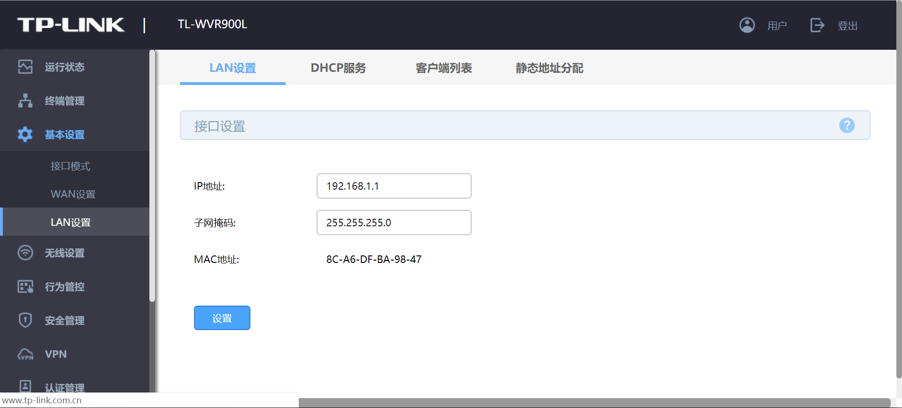

## 205


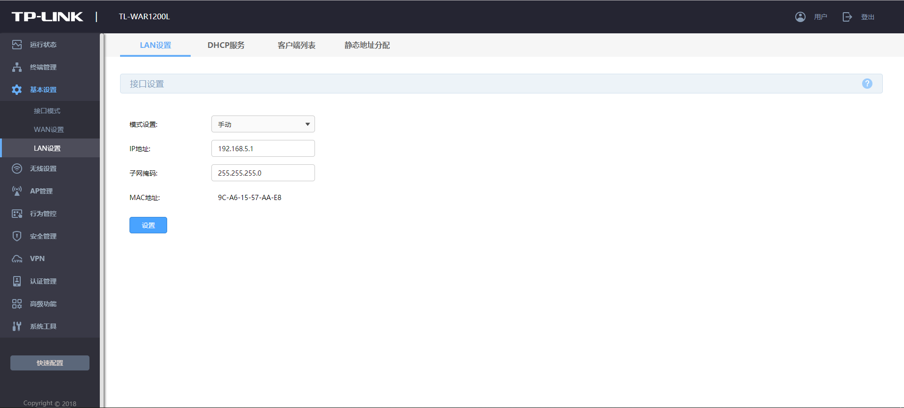

## 303 WAN1 `192.168.1.127` 

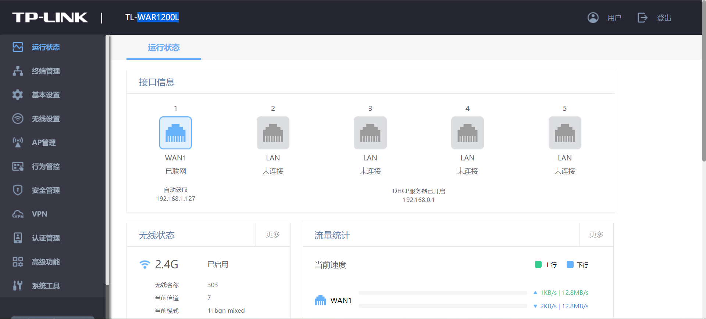

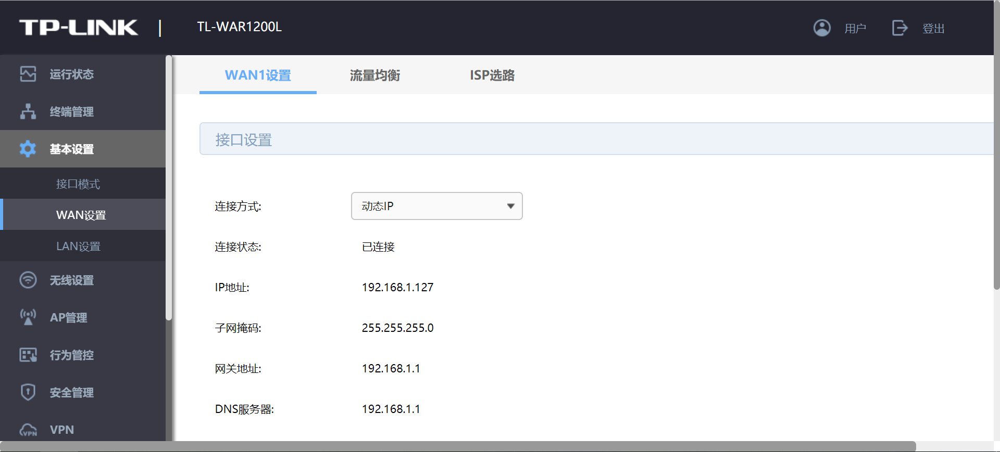

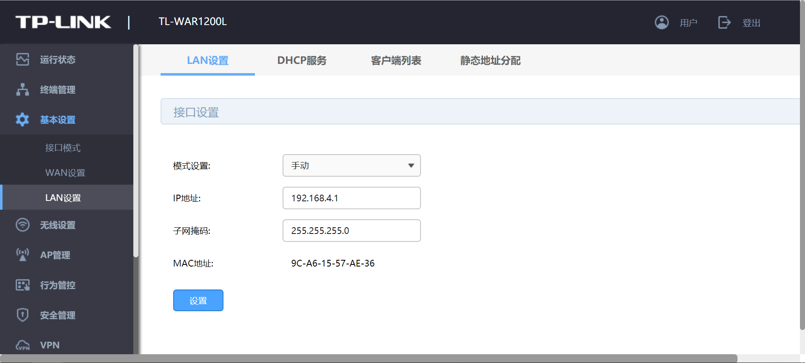

## 305

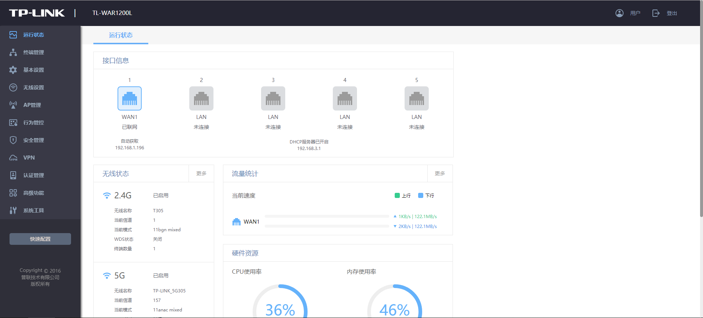

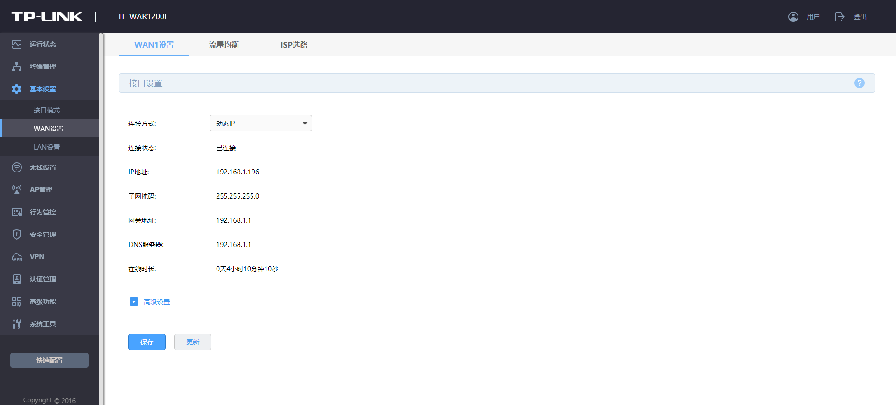

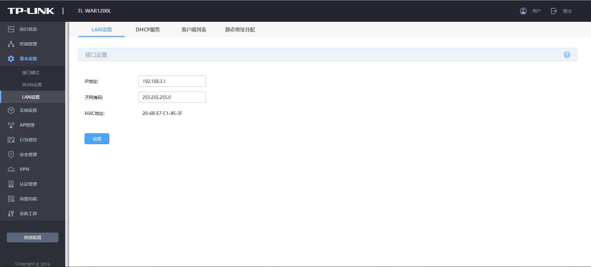


405

## G2L

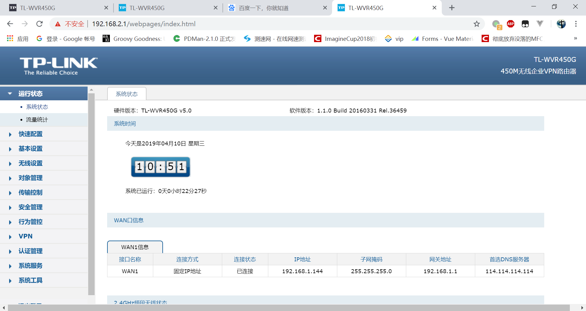