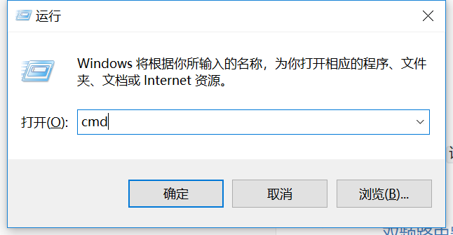

# 常用信息

- 宽带

  - 小哥：`133 8587 4559`；

  - 电信经理：`15305776192` `升级千兆`

  - 电信故障：10000

  - 如何设置网络红灯

    

- 海康威视：400-800-5998

  - 85.6×53.98 mm

- `TPLINK`技术售后：400-886-3400 -> 2企业

  - 已购型号：TL-WVR900L、TL-WAR1200L、 TL-WVR450G
  - 网络汇聚问题：`双WAN`

- 瑞安本地安防服务商1：
  - 蔡丰电脑
  - 宏都小区25幢东起3号
  - 联系号码：136 4656 4301 

- MAC在总机设置绑定；

  - 必须是LAN/LAN绑定；

  - 关闭DHCP模式? `VPN路由器`A.LAN ,`900L路由器`B.WAN,`900L路由器`C.WAN

    - 关闭A路由器,是所有的都要关闭吗?为何要关闭?关闭哪一台?

    

- AP方案比对问题,利旧得前提下如何进行操作;

  - 无线ping的方式判断线路是否有问题;
  - 改5G的翻墙性能较差;
  - 2.4G信道改
  - 1\6\11
  - 36\161
  - `AP面板的 负载均衡`


- 关闭电信光猫的拨号功能，光猫改为`桥接模式`
  - 路由器汇聚`ER6120G 5.0` ，1G速度；
  - 多电口光纤收发器；


## 宽带口令

100M：

- `YZtr`
- 2r4mpixp
- http://192.168.1.1:8080/ useradmin/dxyyp

500M：`sDGv`：


http://192.168.1.1:8080/


## NAS

如果你已经有服务器了，你的数据量真的达到了需要独立NAS的量级了？

- 没有分级存储：热点数据和温数据一视同仁，经常使用的数据，我们成为热数据，使用频度比较低的数据，我们成为温数据，服务器的硬盘价格比较高，但只使用服务器当做存储，是把所有的数据一视同仁，导致不常用的数据也都存放在比较昂贵的服务器中，性价比比较低。

- 互联网访问：通过互联网访问服务器的数据，需要配套相关的防火墙、路由、VPN设备，而且通常只能在PC客户端使用，经常出差的营销、市场人员访问企业的服务器，不是很方便。


## 光纤

你确认Lan内需要

[FTTC](https://baike.baidu.com/item/FTTC)（光纤到路边）、FTTZ（光纤到小区）、 FTTB（光纤到大楼）、FTTO（[光纤到办公室](https://baike.baidu.com/item/%E5%85%89%E7%BA%A4%E5%88%B0%E5%8A%9E%E5%85%AC%E5%AE%A4)）和FTTH（[光纤](https://baike.baidu.com/item/%E5%85%89%E7%BA%A4)到户）；

光纤收发盒：

- EPON和GPON桥接光猫 可取代 运营商的桥接模式光猫，但需与运营商确认；
- 光纤收发器则是用于跨楼宇之间的传输；
- https://item.jd.com/24091199731.html


- 交换机：**TL-SH1226**、光模块TL-SM531LM；
- 因为10G初期，大量使用光口。初期IDC建设都是光口，随着这些设备的淘汰，大量洋垃圾冲击市场，使得万兆光口异常的便宜。外加运营商大量光模块非正常渠道流入市场，光耗材价格非常低廉。万兆光有两种链接方式，短距离的DA Cable和长距离的光模块


- 3类线材：

  - RJ45，10G；
    - [千兆网络，当年也是先出光纤，后出电口，最终历史选择了千兆电口。而万兆10G网络，最终进入百姓家是光还是电，且听下回分解。](http://koolshare.cn/thread-128540-1-1.html)
    - CAT6的布线就能满足55米10G传输，使用CAT6A能达到100米10G传输。
    - 使用7类水晶头；
  - SFP+，10G 几十块钱，；
  - Quard SFP，56G IB, 100元/m；

  


- WLAN网卡

  - 钟雨飞：第一个问题是一万1对于用户来讲好处是什么，万兆速度背后因为这个路由器有三个频段，一个是2.4G，一个是5G-2，5G-1，三个并发速度是一万一千兆，为什么叫三频，传统路由器都是单频的，手机在搜的时候只有一个信号，只能连其中一个，如果说三频就意味着路由器可以由额外两个，是这样子。
        如果单从数值上距离，万兆的例子是什么，如果跟现有比较普通的单频不用说了，1200兆的路由是上频的，速度将近相差九倍。

    

- 网卡ConnectX-3

- InfiniteBand，Ethernet

- [yiwang](https://www.youtube.com/watch?v=AI4oXXt8a0s)

  


讯怡，高科，四海，联众


- 100M(192.168.1.10)/24 dxyyp
  - 057753106762 /axx1xx
- 500M(192.168.1.9/24) sm5by
  - 057740422934/axx1xx


# 机房管理规范


- `第三方设备`（如`运营商的光猫`、`GA的解调器`、`入户线`）与`校方设备`安置在不同机柜，便于后续机房迁移时不需拆挪设备；
- 数量设备采购：
  - 多一个设备就增加`系统故障率`及`运维成本`，因此采购前要好好考虑；
    - 例如：一定需要行为管理机吗？若只需要MAC限速，网络行为管理；
  - 所有校方设备采购需提供`管理员`，`规划机柜位置`，`设备说明`；
- 线材长度：入机房的长度以入柜长度为宜，并保留10m备长线；过长占用过多空间，过短则会无法入柜；
- 远程管理规范
  - 入户光纤、以及机房网络，需接入统一远程管理PC；
  - 管理PC可访问子网下所有路由器（宽带）、交换机、打印机；

## 设备尺寸

DELL R7425

**深：**67.73厘米（26.67英寸），但是要用导轨的话仍然需要`1m`深机柜；

**宽：**43.4厘米（17.09英寸）

**高：**8.68厘米（3.42英寸）  


- TP-LINK推荐组网方案：


## 配线/理线/跳线

从上到下

`配线架`用来减少设备接口插拔的：

- 通常应用在`设备需要频繁移动`的场景；
- 没有配线架意味着`接线`直接接入到`设备`，多次插拔可能引起交换机端口的损坏；且需要对多个设备进行插拔，如果你的机柜有2m；
- 配线架的存在就解决了这个问题，可以通过更换跳线来实现较好的管理。

`理线架`相当于一个`夹子`负责把线理整齐；


### 理线环/轧带

[其实只要买这个就够了；](https://detail.tmall.com/item.htm?spm=a230r.1.14.153.7fa027dfX1hNmu&id=43774386915&ns=1&abbucket=5)


## PoE AP

[PoE供电](https://www.baidu.com/s?wd=PoE%E4%BE%9B%E7%94%B5&tn=SE_PcZhidaonwhc_ngpagmjz&rsv_dl=gh_pc_zhidao)有两种模式：

- 模式A（空闲线45,78供电）：45为+，78为-；
- 模式B（数据线12,36供电）：36为+，12为-。

`IEEE802.3af`标准定义的供电电压是直流44-57v；

`IEEE802.3at`标准定义的供电电压是直流50-57v；


## 路由器

- 你真的明白路由器的作用吗？如果你知识需要WIFI，用路由器来做放大器实在是大材小用，应该使用`AP`！
- `多WAN口路由器`用来做`宽带汇聚`；
- `WAN口`与`LAN口`区别：
  - Wide Area Network 广域网，一个接口一个网段

  - Local Area Network 本地网，一组在一个网段

  - 10.0.0.0/8

  - 172.16.0.0/12

  - 192.168.0.0/16 可容纳上万台主机

    - **192.168.0.0 - 192.168.255.255** (65,536 IP addresses)
    - **172.16.0.0 - 172.31.255.255** (1,048,576 IP addresses)
    - **10.0.0.0 - 10.255.255.255** (16,777,216 IP addresses)

- 路由器串接：
  - 以203为例，它的3个LAN出口其实刚好是3个205、305、303的WAN口，所以203必须是.1网段；
  - 3个路由器；
- 通常默认WAN口是192.168.1网段，LAN口设置静态网段需避开此网段，否则需要重置；
- 如果只用路由器的LAN其实就是交换机；


- [双频路由器](https://baijiahao.baidu.com/s?id=1608239954008774952&wfr=spider&for=pc)

- WDS无线桥接是对于两个WIFI之间无线材连接的方法，对于已经连线的路由器无需使用。


## todo

- 测试203的WAN口IP改成静态192.168.2.xx(以确认是否必须是0.xx；

  - 预计是可以的，因为VLAN接出来的接口是1-2，并非是第一个，因此可能无固定关联；

- 购买备用路由器测试用；

  - 企业路由器：https://item.jd.com/5531915.html#crumb-wrap

- 布线整理完毕后
  - `交换机`3号口接线(`2-3`)无信号（不知道以前是否有），`插上电源`后显示有信号；
  - 原`路由器`2号口接线(`1-2`)太短接不上，接在交换机1(2-1）上，有信号源；


- VLAN路由器 CONSOLE口无法联通；
- `交换机`管理员密码以及重置方法；

  - 电脑直接连交换机无法使用网络；

- 入网有一个分线盒，可否取代？  

- 入户线无标志，无法了解究竟哪根线对应哪个区域；

- 许多入户线长度只有1m，太短无法`正常`入柜；

  - 需请人重新拉线；

  


​	

# 教室会议系统

10人以内用微信APP；

10人以上用会议系统；

- 在线课堂，通过`专用APP`或PC客户端接入；


1，摄像机 （USB摄像头也行）高拍仪
2，音响系统（也可以用耳机，麦克风替代）
3，电脑 （可以录屏 ，做PPT讲解 。也可以编辑录好的音频视频）
4，全自动录播主机（备选方案，做教室课程录制）
5，虚拟演播室系统（备选方案，动手能力强用非编软件即可完成）
6，软件要求：假如不考虑盗版侵权问题，加上强烈的自学能力。去网上找盗版非编软件即可。加上常用的非编软件。针对不同的课程，也有不同的演示软件


在2021年左右，达到800人；


VI设计，4个月：

- cocacola 的流体；

- 杭州的国内水平；

- 网站设计；

- 推广/招生

  - VI设计：

    - 网站放后，TOP 10重点
    - 校训
    - 卡其色
    - 学校建筑颜色
    - 透明
    - 员工感知：PPT模板，红色；

  - 部门创建：

    

    


组织架构：

- 如何控制；
- 


# 监控

- 备用摄像头  x 1 

- 图书摄像头 x 1；
- 海康威视 x 32摄像头方案


门禁监控Iz：

http://www.360doc.com/content/18/0103/15/17524610_718722175.shtml


# 网络管理方案

## 行为规范


## `教学办公网`(500M)

wifi名称：203/205/303/305

在目前就`教学办公网`络有限的情况下，仅允许绑定mac连接`教学办公网络 5MB/s`，访客只允许访问总带宽固定的`访客低速网络1MB/s`；

- 路由器设置定时重启/清空路由表。

- 目前每个老师教师绑定一台设备MAC，网络限定速度为5M/设备；

  

### [mac获取方法](https://jingyan.baidu.com/article/b0b63dbf3fefd14a48307013.html)

  - 启动终端：

    - windws：点击键盘`WIN/旗帜键 + R` -> `cmd` 

    

    - mac：launchpad -> terminal

      

   - **输入如下网卡检查命令**，将结果中`无线局域网`对应的**物理地址**粘贴到[石墨](https://shimo.im/sheet/k32Q7H0eLQ0Te92J/R3DFr)(企业微信登陆后若跳转需再点击一次)
  ```bat
  # WINDOWS下输入
  ipconfig /all 
  # MAC下输入
  ifconfig /a
  ```
   

---

## 访客网(100M)

`访客网(wifi名称：ruianVAx)`：网络限定速度为1M/设备，密码定期目前暂定为`ruianVA123`；

- 为便于课堂纪律以及校园网络管理，网络接入将限制学生`个人的电子设备`接入任何网络；

    - 原则上，应配合通知家长禁止携带个人手机/电脑；
    - 对于社会课上对检索的需求：图书馆将采购一批`树莓派`作为上网检索工具，可转移到图书馆进行；需@奇美 胡校理一下图书馆。


## 运维办法

- 确认光猫颜色是否为红灯；
- 确认光猫WIFI网络是否正常；
- 确认路由器是否正常；

- WAN汇聚，两根宽带汇聚在一起，必须强制要求MAC绑定；

  


# 路由器情况


## 203


## 205


## 303 WAN1 `192.168.1.127` 


## 305


405

## G2L


## G3L


S209

192.168.11.2

DC-FE-18-89-8D-76


仅允许IP-MAC绑定的数据包通过路由器

下面


# 安全管理->ARP防护

https://service.tp-link.com.cn/detail_article_3477.html

ARP是IP与MAC地址的解析协议，对网络通信至关重要。一般情况下，上网数据直接在主机和网关之间进行交互，ARP欺骗主要针对网关和主机的ARP列表进行欺骗，导致通信异常。


# 流媒体

`obs studio`: 可以采集、编辑、推流，需要另外的服务器做分发

`only office`: 在线办公

`next cloud`: 文件共享

```
docker 
next cloud
add app->only office

```


# 树莓派客户端

连接`192.168.1.1`

输入法：

`sudo apt-get install fcitx-sunpinyin`

`sudo apt-get autoremove fcitx-*`

键盘-英语（美国）

`killall fcitx-qimpanel`

```
sudo rm -rf ~/.config/lxpanel/LXDE-pi
```

## 远程连接设置

vncviewver no support authentication methods

By default, the RealVNC Server uses "UNIX Password" authentication, which allows you to login using system account credentials (e.g. pi/raspberry). However, this security type is only supported by the RealVNC Viewer. If you wish to use other viewers, then you will need to configure the server to use "VNC Password" authentication (you can select this on the Security page of the VNC Server Options dialog), and specify a separate password for use with VNC.

optipns->seetings 

Encryption: prefer off

VNC password


## SSH创建连接

## MSTSC

windows

```
net user visitor /add /active:yes
net localgroup users visitor /delete
net localgroup
```

https://www.realvnc.com/en/connect/docs/user-permission.html

https://jingyan.baidu.com/article/67508eb401774c9cca1ce4fe.html


## mplayer

```
http://www.mplayerhq.hu/DOCS/HTML/zh_CN/commandline.html
-loop 3

```

