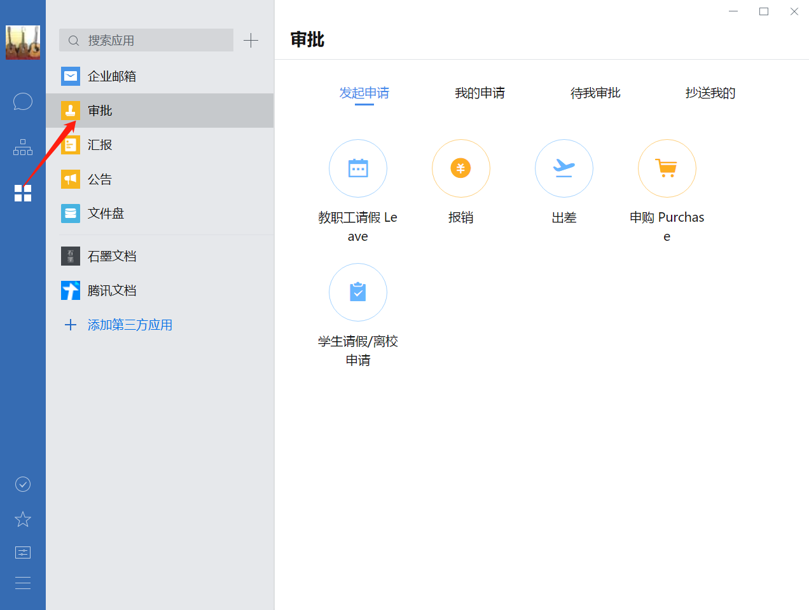

# 审批

PC客户端：

# 办公室耗材

供应商：

打印机：

- CANON MF4712
  - 有如下故障：双页打印过程
  - 使用废纸：正面朝下
- DocuCentre S2110
- CANON imageClassLBP161
- EPSON L6168

- 位置、网络

- [无装订，自动双面扫描](https://detail.tmall.com/item.htm?spm=a230r.1.14.22.3a362a4fcQQ6rf&id=39982630894&ns=1&abbucket=5&skuId=3654013253560)
- [装订书](https://detail.tmall.com/item.htm?spm=a230r.1.14.6.f57c5bb8qvvuAw&id=574849632380&cm_id=140105335569ed55e27b&abbucket=5)

  

DouCentreS2110 上网；

