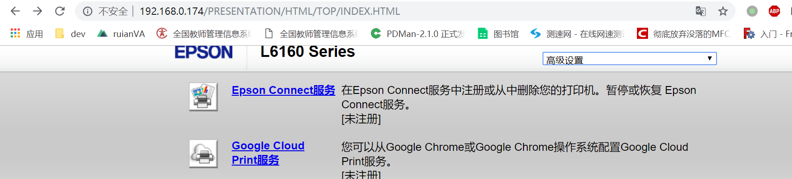

# 概述

关于it办公自动化：
- 以整个学校效率出发改进，`个人`效率服从`团队`效率；
- 通过it手段简化传统`行政合规`的各种必须但又繁琐的环节；

# 树莓派

  203门口座位上是一台微型电脑（树莓派），请大家这几天可以试用一下：

- 好处：

  - 大显示器，保护颈椎；
  - 性能配置比学校配置的电脑好（且可动态调整）；
  - 内网接入设备(个人电脑、树莓派)，通过自己的 账号/密码登陆自己的虚拟机电脑（`WIN7`）；
  - 再也不用带着笔记本跑来跑去，再也不要重复地插拔`HDMI`线；
    
    

- 坏处：

  - 无法带回家，资料的拷入/拷出要使用u盘；
  - 视频播放存在延迟、掉帧现象；
  
- 需要配备此电脑请[在此]( https://docs.qq.com/sheet/DWGNUdFJId0ZxSG9K?opendocxfrom=admin&tab=23c75r&coord=D1A0B0)登记 ；

- 备注：不能安装盗版软件；

具体操作可搜索 wiki 的 "树莓派"  ；


## `树莓派`&&`云桌面`

`树莓派`：是一台微型电脑，和你的个人电脑相比：它的系统不一样（是linux系统）、它的配置差一点。配置差没关系，我们只是用这台电脑`远程登陆`服务端的`虚拟电脑`/`桌面云`，这个`虚拟电脑`是可配置的、调整后可能比你的个人电脑性能还强；


- 树莓派开机：


- 远程连接

```
xfreerdp /u:va /p:va /v:192.168.2.11  \
/sound:sys:alsa,format:1,quality:high --plugin cliprdr #音频 \
/fonts #字体 \
/drive:'USB0,/media/pi' \加载USB
+clipboard \
+compression \
```

树莓派关机：


## 基础设施


# 共享FTP

使用方法：启动文件浏览器，键入`ftp://ruianva@192.168.1.147`，密码同`ruianva`的wifi密码，可问`shangrong`;


- 服务端
  - 安装filezilla server；
  - 设置被动模式；
  - 防火墙开`入端口`：21,60000-60020
  - 创建目录以及相应用户


# PPT+水印

增加一个水印文本框在首页，选中后复制

`ALT+F8`创建宏

```vb
Sub CopyWatermark()
    Dim osh As Shape
    Dim osl As Slide
    Dim x As Long
    
    Set osh = ActiveWindow.Selection.ShapeRange(1)
    
    osh.Tags.Add "WaterMark", "YES"
    osh.Copy
    
    For Each osl In ActivePresentation.Slides
        ' Don't paste the watermark atop itself
        If osl.SlideIndex > 1 Then
            osl.Shapes.Paste
        End If
    Next
    
End Sub
'' And this will delete all of the watermarks for you:
Sub DeleteWatermarks()

    Dim osl As Slide
    Dim osh As Shape
    
    For Each osl In ActivePresentation.Slides
        For Each osh In osl.Shapes
            If osh.Tags("Watermark") = "YES" Then
                osh.Delete
            End If
        Next
    Next

End Sub
```

运行


# 打印机

## 打印机管理员注意

- 用纸条写上"禁止`直接通过线缆`方式接入打印机"放在明显的地方，因为线缆的插拔很容易导致机械故障；

- 限制打印机直接发现；
  
- 通过`公用电脑`统一安装驱动并共享出来，这样一个网络内的所有同事都可以方便快捷的安装，具体操作办法见`设置共享打印机`章节；
  
- 所有打印机都`设置了物理IP`，并以LAN方式接入（打印机禁止以WLAN方式接入网络，网络）。

  - 对于没有网口的打印机，则直接以线缆连接`公用电脑`连接，并在线缆上注明`勿插拔`标示；

  

## 打印机驱动安装

使用203门口的公用电脑安装了4台打印机的驱动并且设置了`共享打印机`，只需接入校园wifi后，无线接入即可：

- 使用方法：

  1. 启动文件浏览器，键入`\\192.168.1.147 `，(若提示要求输入账号，输入登陆账号lenovo，密码20171220)

  2. 双击你要使用的打印机，安装后就可以使用该打印机；

     
     

## 打印机故障诊断

若发现多台共享打印机**同时无法使用**；

1.确认是否接入校园wifi；

2.登陆`\\192.168.1.147 `，若提示，输入账号`lenovo`，密码`20171220`；

3.先使用公用电脑来进行紧急打印，输入登陆账号lenovo，密码20171220；

4.联系学校IT；


Q&A 弹出

解决方法：
１、运行 服务，`services.msc`打开服务窗口；
２、开启以下三个服务；
       Computer Browser
       Server
      Workstation

３、关闭防火墙：关闭"Windows Firewall"服务；


## 设置共享打印机

- 打印机服务端（203门口台式机）

WIN10 ：WIN->打印机 ->管理->打印机属性

- 安装`组策略`

  ```BAT
  @echo off
  pushd "%~dp0"
  dir /b C:\Windows\servicing\Packages\Microsoft-Windows-GroupPolicy-ClientExtensions-Package~3*.mum >List.txt
  dir /b C:\Windows\servicing\Packages\Microsoft-Windows-GroupPolicy-ClientTools-Package~3*.mum >>List.txt
  for /f %%i in ('findstr /i . List.txt 2^>nul') do dism /online /norestart /add-package:"C:\Windows\servicing\Packages\%%i"
  pause
  
  ```

- 开启GUEST用户

  

- 配置策略组


在右侧策略处找到`账户:使用空白密码的本地账户只允许进行控制台登录`，此策略默认是已启用；双击打开“账户:使用空白密码的本地账户只允许进行控制台登录”，将其改为“已禁用”

- 设置打印机为共享


### 提示驱动更新

通常是由于客户机为32bit os导致，设置打印机服务器增加32 bit驱动即可。


### 删除默认登陆密码

以前用A身份访问工作组里一台服务器(保存了用户名和密码)，现在想用身份B登录那台服务器。怎么才能使A身份实效呢?我用 net use * /d /y和net session 計算機名 /delete提示操作成功，但是仍然可以连接，不起作用。
　　回答：
　　根据我的研究，您可以通过以下方法清空计算机上存储的用户名和密码，具体的操作步骤如下：1. 单击“开始”，单击“运行”，键入“control userpasswords2”或　输入“control keymgr.dll”，然后按 Enter. 2. 单击“高级”选项卡，然后单击“管理密码”。
  　　3. 移除所有存储的密码。
       “存储用户名和密码”的行为根据我的测试，无论是移除所有存储的密码，还是使用net use * /d删除所有的已有连接，都需要重新启动计算机才会在访问该共享文件夹的时候，重新出现输入用户名和密码的提示。如果您不希望重启计算机的话，可以重启“workstation”服务来进行测试。


## 203-1.CANON MF4712 1500元

- 有如下故障：双页打印过程
- 使用废纸：正面朝下

- 换墨盒流程：
  - 
  - 

- 卡纸处理：

## 203-2.DocuCentre S2110 2500元

这台打印机是胡校长2017年在温州托朋友低价购入，出现问题频率较高，若发现无法打印，首先启动网页浏览器（IE/CHROME/）测试：

```
http://192.168.1.148/
```

- 若发现这个网页弹出账号、密码，则表示网络无问题；
  - 在上述基础上，尝试重启动打印机看是否可行，
  - 若故障依旧，则联系后勤员；
- 若发现这个网页无反应，则表示网络有问题，则联系IT技术员；

### 驱动安装

下载：`施乐复印机s2011驱动程序.exe` DocuCentre S2110 UG_SC.pdf

登陆按4s->输入5个1->启动->输入202->启动两次


- 设置固定IP 

  - 192.168.1.148 端口：9100

  3117

Q：遇到了`E3但是并未发现卡纸`；

A：取出所有的纸张，使其变成`C1`，再放会纸张；


  

  

  

## 203-3.CANON imageClassLBP161 1500元 28ppm

- EPSON L6168
  - 位置、网络

  

- 扫描机

  - EPSON: [对于非装订，自动双面扫描](https://detail.tmall.com/item.htm?spm=a230r.1.14.22.3a362a4fcQQ6rf&id=39982630894&ns=1&abbucket=5&skuId=3654013253560)
  - CZUR成者科技：[装订书](https://detail.tmall.com/item.htm?spm=a230r.1.14.6.f57c5bb8qvvuAw&id=574849632380&cm_id=140105335569ed55e27b&abbucket=5)


## 203-4 EPSON 4000元

`192.168.1.150`

打印面：下面





# 云桌面远程

## WINDOWS下连接云桌面

键盘`WIN+R`，输入`mstsc`，输入账号、密码，点击`显示选项`，另存到桌面以后就可以点击进入

