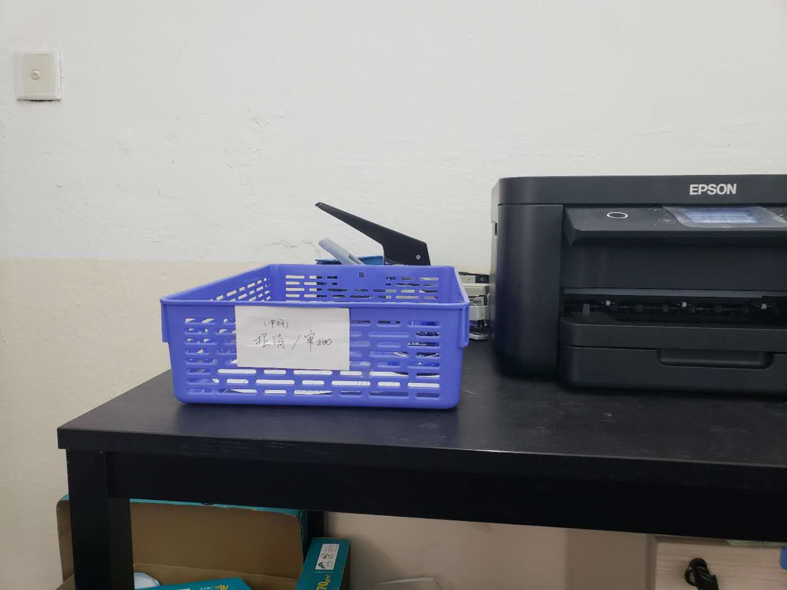
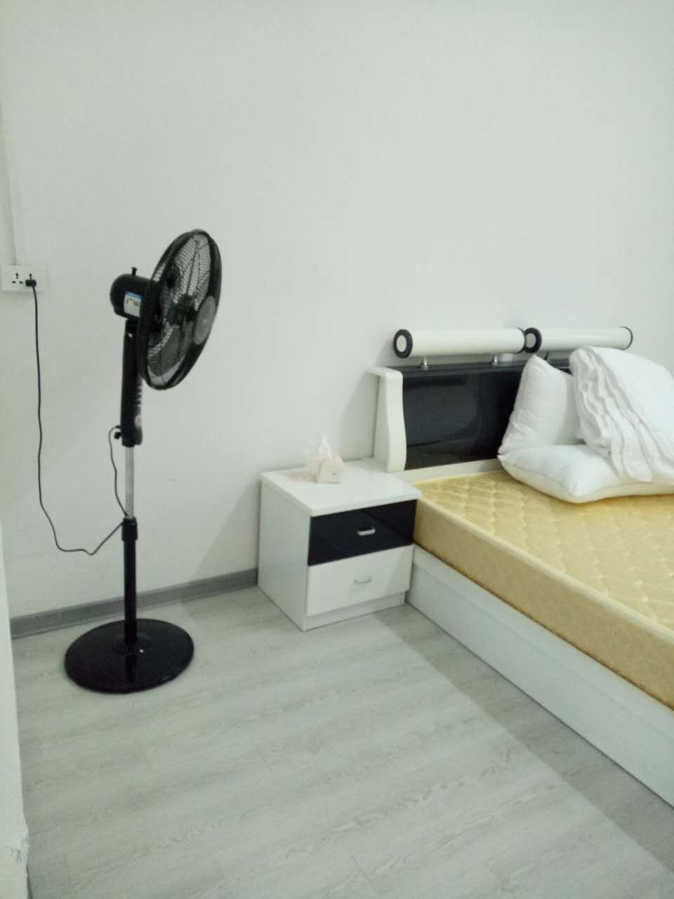
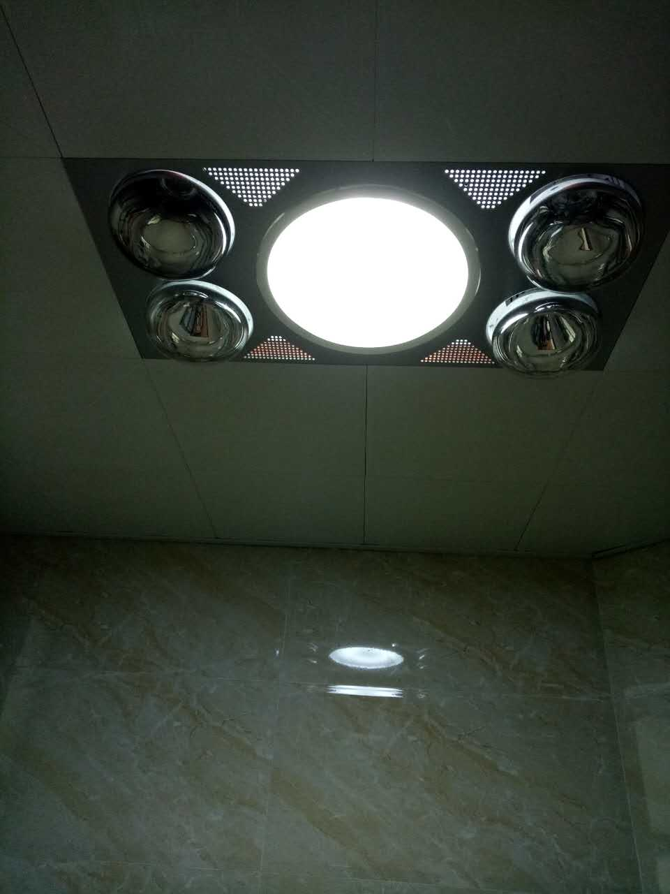
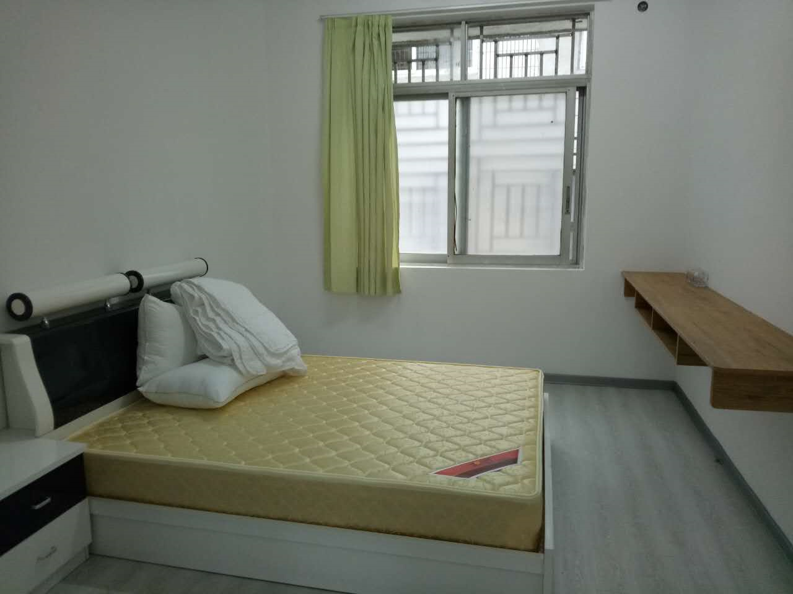
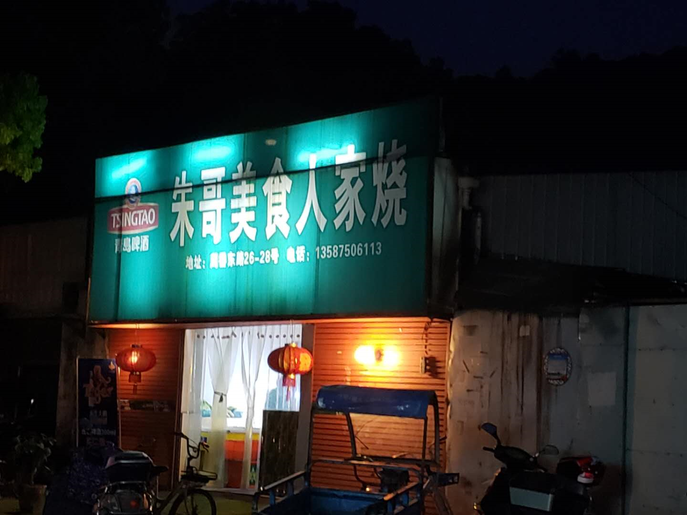
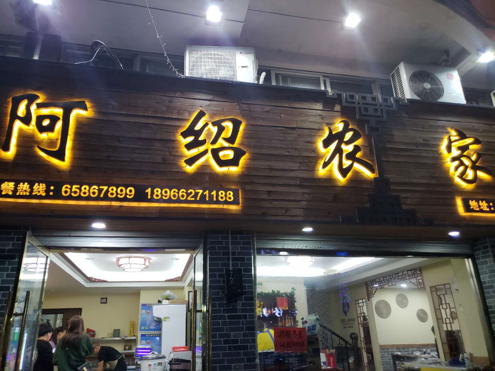

# 常用信息

- 校区地址

  俱乐部/中小学：瑞安市锦湖街道周松中路88号

  HKDSE预科部：温州市s龙湾区瑶溪街道雄心村

- 增值税(普票)报销抬头：

  - 抬头：`瑞安市惟理达书院`
  - 税号：`52330381MJ9303488F`

- 技术&装备后勤报修：

  - 林奇：13967759580
  - 薛增荣（薛叔）：180 5773 0600
  - 杨家昊: 136 09854238
  - 企业微信 维修审批单

# 网络&打印机使用

- wifi:

  - `203-5g`:`123456a78`
  - `203-2.4g`:`123456a78`
  - `ruianva`:`ruianVA123`

- `打印机`，`报销`，`taobao`.... 

  

# 报销流程

`报销`即通过`自费`购买自行报销的流程；

- 购买前在企业微信提`费用报销单`审批；

  

- 审批通过后打印`费用报销单`+ `商品发票`用回形针🖇扣好放到`作业岛`(空调旁边的紫色框)；

  

- `财务`：郑恩其

  - 联系信息：153 8258 0707
  - 周1/2/5中午在402；

# 教学楼分布图

# 学生上课时间

开学备课期：`8:30 am ~ 5:00 pm`

开学上课期：`7:45 am ~ 5:00 pm`

上午4节、下午4节，每节课45分钟；其中，第2节和第6节下课大课间15分钟，其余小课间5分钟，午间50分钟；

校历时间

请搜索`企业微信`下载

# 我们需要Todolist

## 注册企业微信

- 电脑版

- 手机版

  Android：打开浏览器`baidu.com`搜索 `企业微信`，点击`普通下载`，安装

  ios：登陆itunes搜索`企业微信`，下载，安装

  使用`相机`/`微信`，扫描如下二维码：

  

# 教师宿舍

## 地址在哪，它的概况是怎样的？

- 地址

  - 位于学校南面；
- 校舍概况

  - 楼向朝南，由于与北面教学楼间距较小，且楼层较矮，光照不理想；

  - 它是本世纪初建筑，基于原学生宿舍装修改造而来的，个别房间水管老化较严重有渗水现象；

  - 共4层，每层约有10个房间，每个房间约30平（每个房间带独立卫生间）；

  - 目前2楼房间基本住满，1楼还有个别房间，3楼有3间；

- 起居方面
  - 厨房：无燃气以及设备，需个人购买材料准备厨房；
  - 家具方面：学校提供基本住宅套件：床、小衣柜（空间较小，类似快捷酒店）
  - 必买三件套；
    - 柜：衣柜、鞋柜等各种容器；
    - 蚊帐：山脚边夏日必备；
    - 除湿机：山脚边夏日必备；
    - 窗帘：170cm * 170cm
  - 洗衣：1楼与2楼都有公用洗衣机，公共晒衣空间较少，最好自备晒衣架；
  - 网络：`ruianva`, 密码`xxxxxXX123`；

`居委会规章`内容旨在解决在繁忙工作节奏下提高各个教职工的生活水平、质量；

## 实地照片

# 校园周边餐饮

- 周松中路

  - 朱哥美食
  - 本地菜，性价比不错，味道好，9分

  

  - 兰州拉面

    

- 体育东路

  - 海鲜面
  - 苹果店旁边的`排骨粉干`（仅供早餐）
  - 一鸣牛奶
  - 阿绍农家
  - 本地菜，味道一般，食材也不是很新鲜，7分；

  

