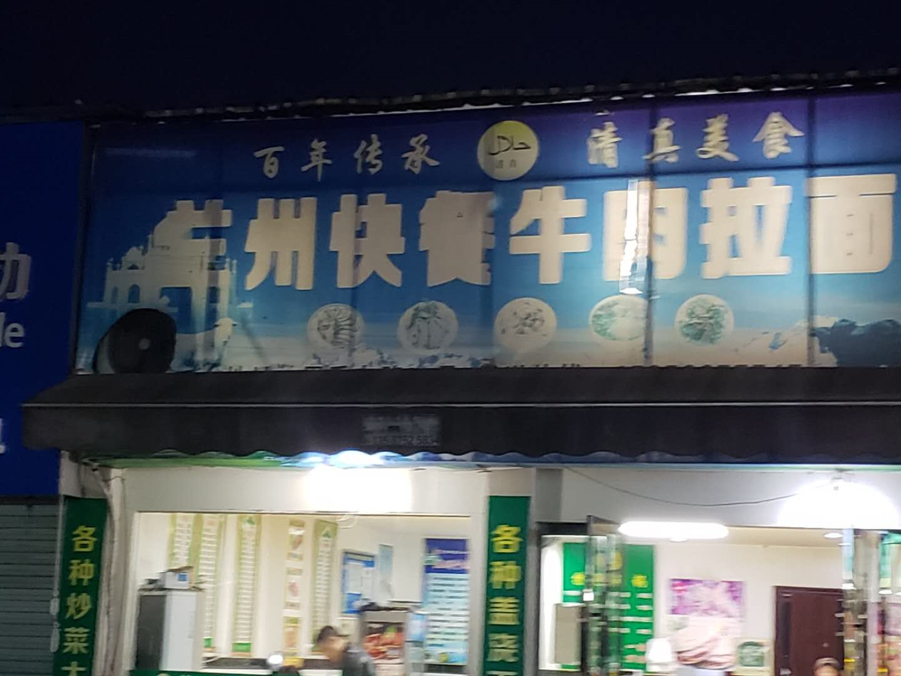

# 常用信息

- wifi:

  - `203-5g`:`123456a78`
  - `ruianva`:`ruianVA123`

- wiki:

  - ruianva.github.io

    

- 校区地址

  小学预科部/中小学：瑞安市锦湖街道周松中路88号

  HKDSE预科部：温州市龙湾区瑶溪街道雄心村

  

- 后勤/故障报修：

  - 林奇：13967759580
  - 薛增荣（薛叔）：180 5773 0600
  - 企业微信 维修审批单
  
- IT：

  - 杨家昊: 136 09854238

# 教学楼分布图

# 上班时间

备课期：`8:30 am ~ 5:00 pm`

上课期：`7:45 am ~ 5:00 pm`

小课间5分钟，大课间15分钟；

# 校历时间

请搜索`企业微信`下载

# Todolist

## 个人电脑连接学校打印机

`wiki`搜索`打印机`

## 注册企业微信

- 电脑版

- 手机版

# 教师宿舍

## 地址在哪，它的概况是怎样的？

- 地址

  - 位于学校南面；
- 校舍概况

  - 楼向朝南，由于与北面教学楼间距较小，且楼层较矮，光照不理想；

  - 它是本世纪初建筑，基于原学生宿舍装修改造而来的，个别房间水管老化较严重有渗水现象；

  - 共4层，每层约有10个房间，每个房间约30平（每个房间带独立卫生间）；

  - 目前2楼房间基本住满，1楼还有个别房间，3楼有3间；

- 起居方面
  - 厨房：无燃气以及设备，需个人购买材料准备厨房；
  - 家具方面：学校提供基本住宅套件：床、小衣柜（空间较小，类似快捷酒店）
  - 必买三件套；
    - 柜：衣柜、鞋柜等各种容器；
    - 蚊帐：山脚边夏日必备；
    - 除湿机：山脚边夏日必备；
    - 窗帘：170cm * 170cm
  - 洗衣：1楼与2楼都有公用洗衣机，公共晒衣空间较少，最好自备晒衣架；
  - 网络：`ruianva`, 密码`xxxxxXX123`；

`居委会规章`内容旨在解决在繁忙工作节奏下提高各个教职工的生活水平、质量；

## 厨房

## 洗衣

## 清理

## 卫生

## 实地照片

# 校园周边餐饮

- 周松中路

  - 朱哥美食
  - 本地菜，性价比不错，味道好，9分

  

  - 兰州拉面

    

- 体育东路

  - 海鲜面
  - 苹果店旁边的`排骨粉干`（仅供早餐）
  - 一鸣牛奶
  - 阿绍农家
  - 本地菜，味道一般，食材也不是很新鲜，7分；

  

# 校园IT资源

